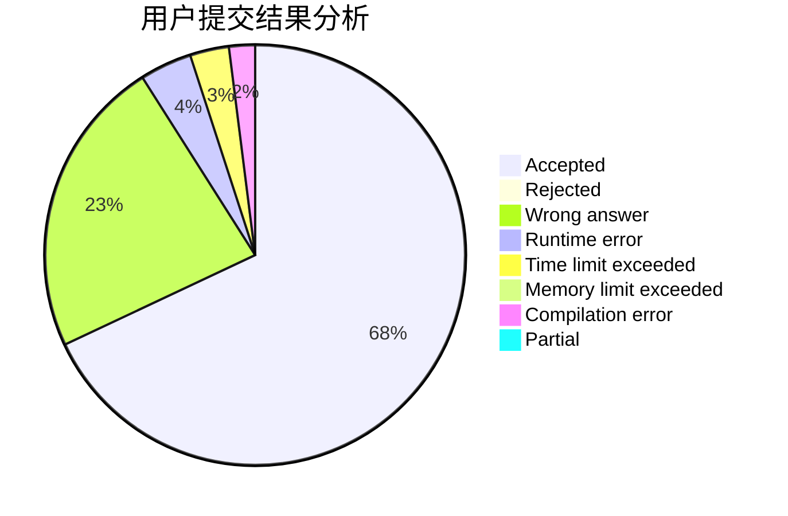
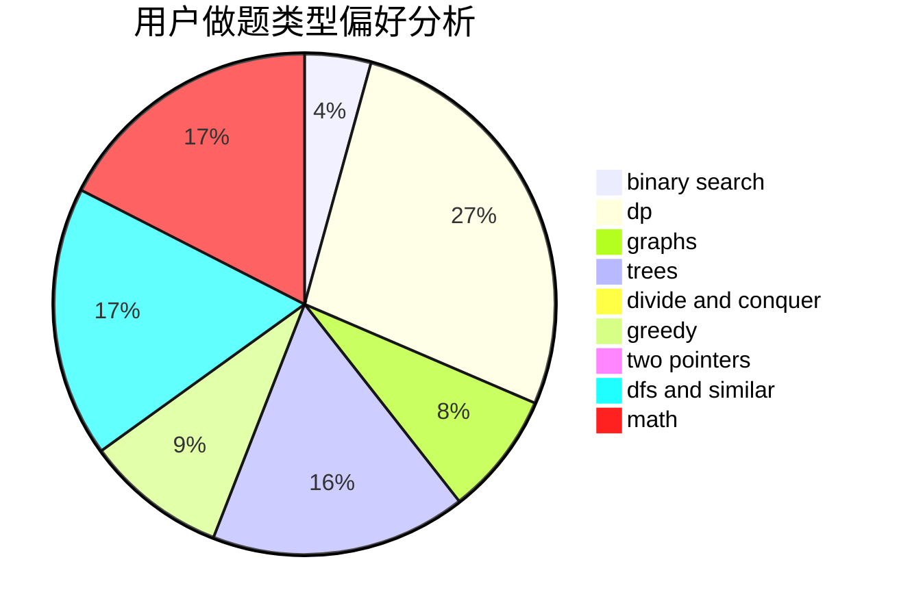

# jhzjk

<!-- tabs:start -->

#### **用户提交结果分析**

#### **用户做题类型偏好分析**

<!-- tabs:end -->
# 推荐题目
[1228B](https://codeforces.com/contest/1228/problem/B)
[925F](https://codeforces.com/contest/925/problem/F)
[715A](https://codeforces.com/contest/715/problem/A)
[1346E](https://codeforces.com/contest/1346/problem/E)
[1059D](https://codeforces.com/contest/1059/problem/D)
[260A](https://codeforces.com/contest/260/problem/A)
[737F](https://codeforces.com/contest/737/problem/F)
[459B](https://codeforces.com/contest/459/problem/B)
[513A](https://codeforces.com/contest/513/problem/A)
[1294D](https://codeforces.com/contest/1294/problem/D)
