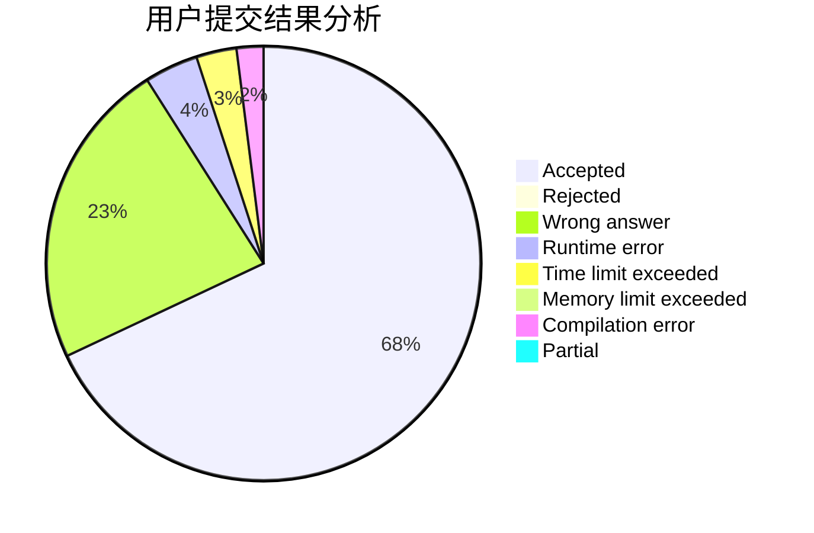
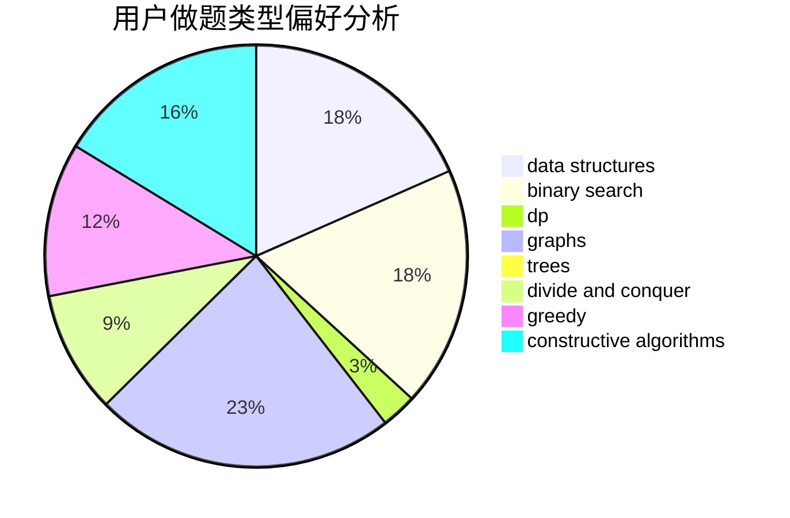

# jhzjk

<!-- tabs:start -->

#### **用户提交结果分析**

#### **用户做题类型偏好分析**

#### **用户错题知识点分析**

<!-- tabs:end -->
# 推荐题目
[1220B](https://codeforces.com/contest/1220/problem/B)		math,
                        number theory		  
[911A](https://codeforces.com/contest/911/problem/A)		implementation		  
[698C](https://codeforces.com/contest/698/problem/C)		bitmasks,
                        dp,
                        math,
                        probabilities		  
[1339E](https://codeforces.com/contest/1339/problem/E)		dsu,graphs,sortings,trees		  
[1059A](https://codeforces.com/contest/1059/problem/A)		implementation		  
[238D](https://codeforces.com/contest/238/problem/D)		data structures,
                        implementation		  
[721A](https://codeforces.com/contest/721/problem/A)		implementation		  
[436F](https://codeforces.com/contest/436/problem/F)		brute force,
                        data structures,
                        dp		  
[493D](https://codeforces.com/contest/493/problem/D)		constructive algorithms,
                        games,
                        math		  
[1287A](https://codeforces.com/contest/1287/problem/A)		greedy,
                        implementation		  
