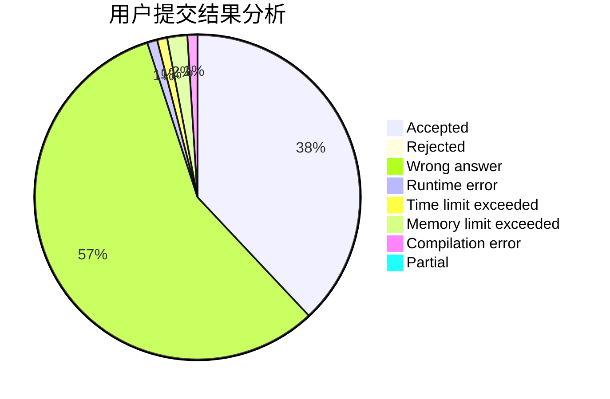
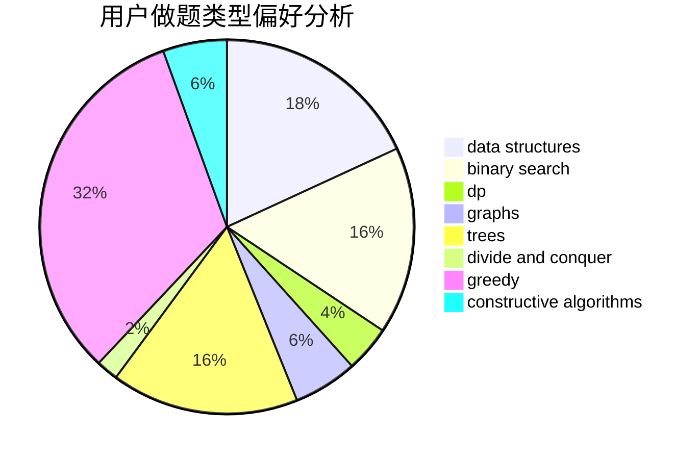
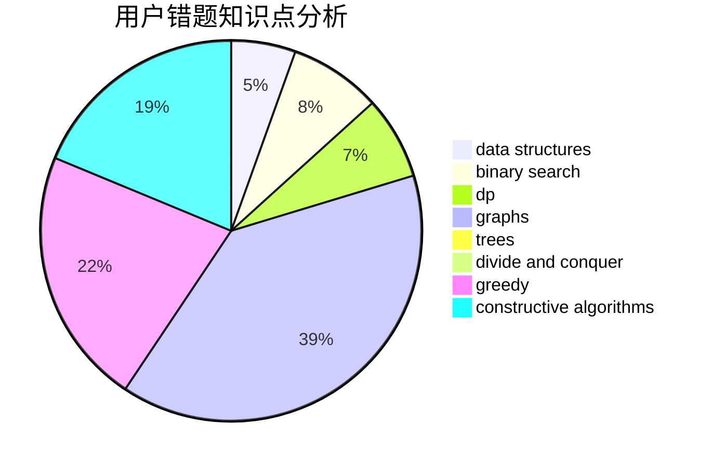

# jiaangk_

<!-- tabs:start -->

#### **用户提交结果分析**

#### **用户做题类型偏好分析**

#### **用户错题知识点分析**

<!-- tabs:end -->
# 推荐题目
[1461D](https://codeforces.com/contest/1461/problem/D)		binary search,
                        brute force,
                        data structures,
                        divide and conquer,
                        implementation,
                        sortings		  
[370B](https://codeforces.com/contest/370/problem/B)		implementation		  
[612A](https://codeforces.com/contest/612/problem/A)		brute force,
                        implementation,
                        strings		  
[1064E](https://codeforces.com/contest/1064/problem/E)		dsu,graphs,sortings,trees		  
[872C](https://codeforces.com/contest/872/problem/C)		dsu,graphs,sortings,trees		  
[6C](https://codeforces.com/contest/6/problem/C)		greedy,
                        two pointers		  
[62A](https://codeforces.com/contest/62/problem/A)		greedy,
                        math		  
[1416A](https://codeforces.com/contest/1416/problem/A)		binary search,
                        data structures,
                        implementation,
                        two pointers		  
[854B](https://codeforces.com/contest/854/problem/B)		constructive algorithms,
                        math		  
[818A](https://codeforces.com/contest/818/problem/A)		implementation,
                        math		  
