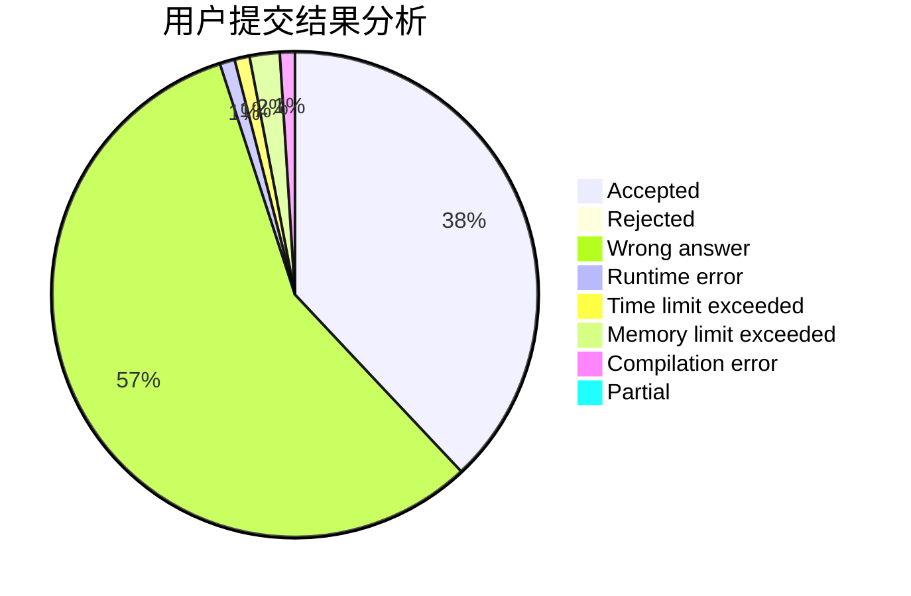
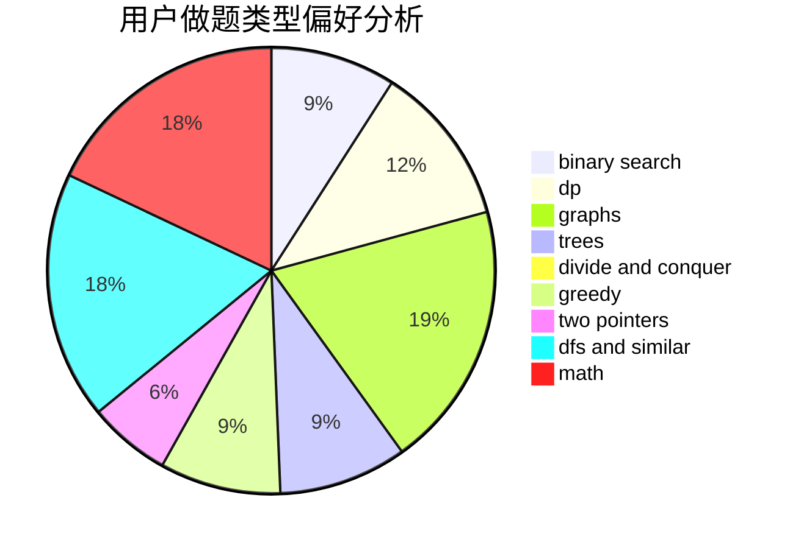

# jiaangk_

<!-- tabs:start -->

#### **用户提交结果分析**

#### **用户做题类型偏好分析**

<!-- tabs:end -->
# 推荐题目
[1468N](https://codeforces.com/contest/1468/problem/N)
[3D](https://codeforces.com/contest/3/problem/D)
[631B](https://codeforces.com/contest/631/problem/B)
[1065B](https://codeforces.com/contest/1065/problem/B)
[893E](https://codeforces.com/contest/893/problem/E)
[717E](https://codeforces.com/contest/717/problem/E)
[659F](https://codeforces.com/contest/659/problem/F)
[1423K](https://codeforces.com/contest/1423/problem/K)
[872C](https://codeforces.com/contest/872/problem/C)
[837G](https://codeforces.com/contest/837/problem/G)
