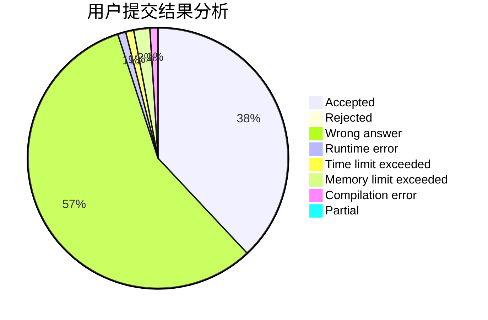
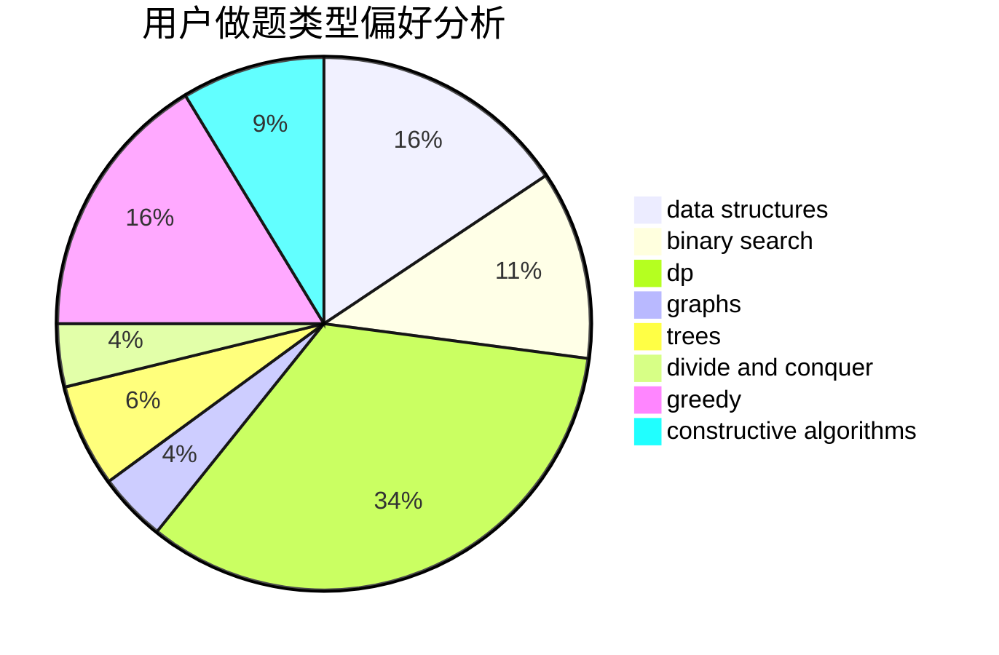
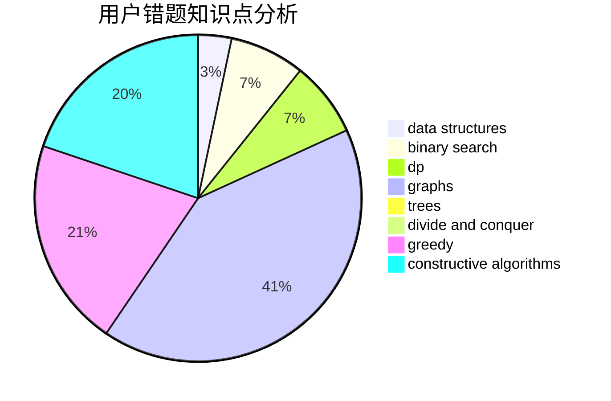

# jiaangk_

<!-- tabs:start -->

#### **用户提交结果分析**

#### **用户做题类型偏好分析**

#### **用户错题知识点分析**

<!-- tabs:end -->
# 推荐题目
[1468N](https://codeforces.com/contest/1468/problem/N)		greedy,
                        implementation		  
[3D](https://codeforces.com/contest/3/problem/D)		greedy		  
[631B](https://codeforces.com/contest/631/problem/B)		constructive algorithms,
                        implementation		  
[1065B](https://codeforces.com/contest/1065/problem/B)		constructive algorithms,
                        graphs		  
[893E](https://codeforces.com/contest/893/problem/E)		combinatorics,
                        dp,
                        math,
                        number theory		  
[717E](https://codeforces.com/contest/717/problem/E)		dfs and similar		  
[659F](https://codeforces.com/contest/659/problem/F)		dfs and similar,
                        dsu,
                        graphs,
                        greedy,
                        sortings		  
[1423K](https://codeforces.com/contest/1423/problem/K)		binary search,
                        math,
                        number theory,
                        two pointers		  
[872C](https://codeforces.com/contest/872/problem/C)		dsu,graphs,sortings,trees		  
[837G](https://codeforces.com/contest/837/problem/G)		data structures		  
