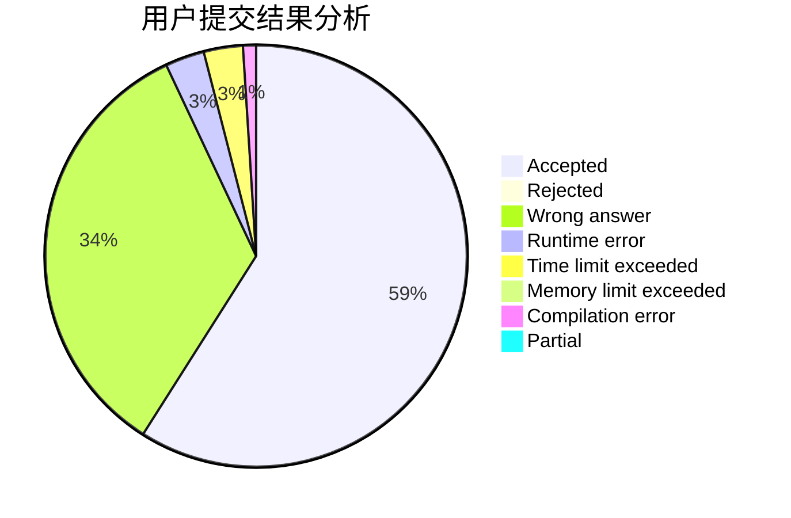
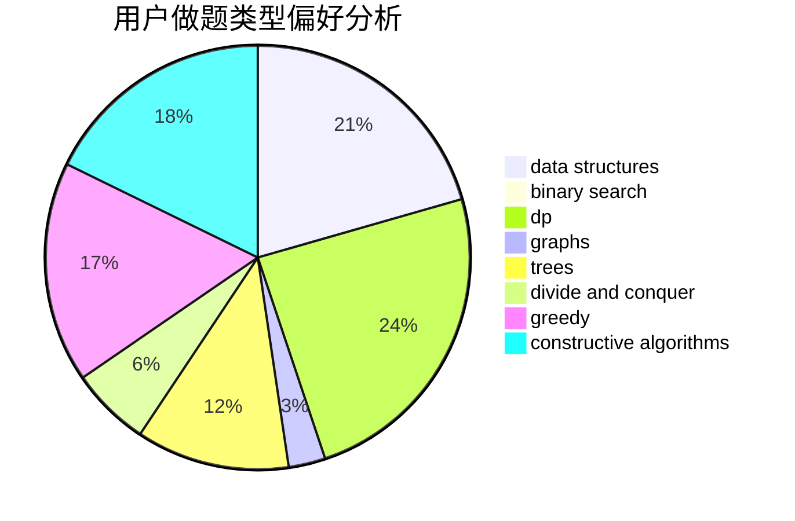

# jianfeng

<!-- tabs:start -->

#### **用户提交结果分析**

#### **用户做题类型偏好分析**

#### **用户错题知识点分析**

<!-- tabs:end -->
# 推荐题目
[825E](https://codeforces.com/contest/825/problem/E)		data structures,
                        dfs and similar,
                        graphs,
                        greedy		  
[1194E](https://codeforces.com/contest/1194/problem/E)		bitmasks,
                        brute force,
                        data structures,
                        geometry,
                        sortings		  
[851D](https://codeforces.com/contest/851/problem/D)		dsu,graphs,sortings,trees		  
[198E](https://codeforces.com/contest/198/problem/E)		binary search,
                        data structures,
                        sortings		  
[602A](https://codeforces.com/contest/602/problem/A)		brute force,
                        implementation		  
[1051D](https://codeforces.com/contest/1051/problem/D)		bitmasks,
                        dp		  
[12042](https://codeforces.com/contest/1204/problem/2)		dsu,graphs,sortings,trees		  
[1250L](https://codeforces.com/contest/1250/problem/L)		binary search,
                        greedy,
                        math		  
[232B](https://codeforces.com/contest/232/problem/B)		bitmasks,
                        combinatorics,
                        dp,
                        math		  
[34A](https://codeforces.com/contest/34/problem/A)		implementation		  
