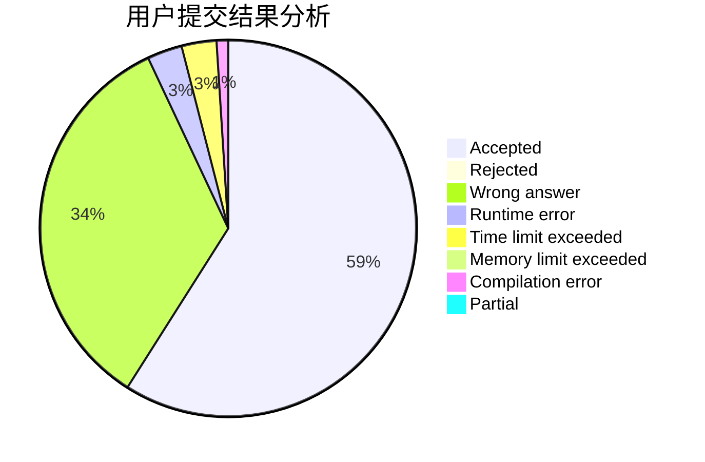
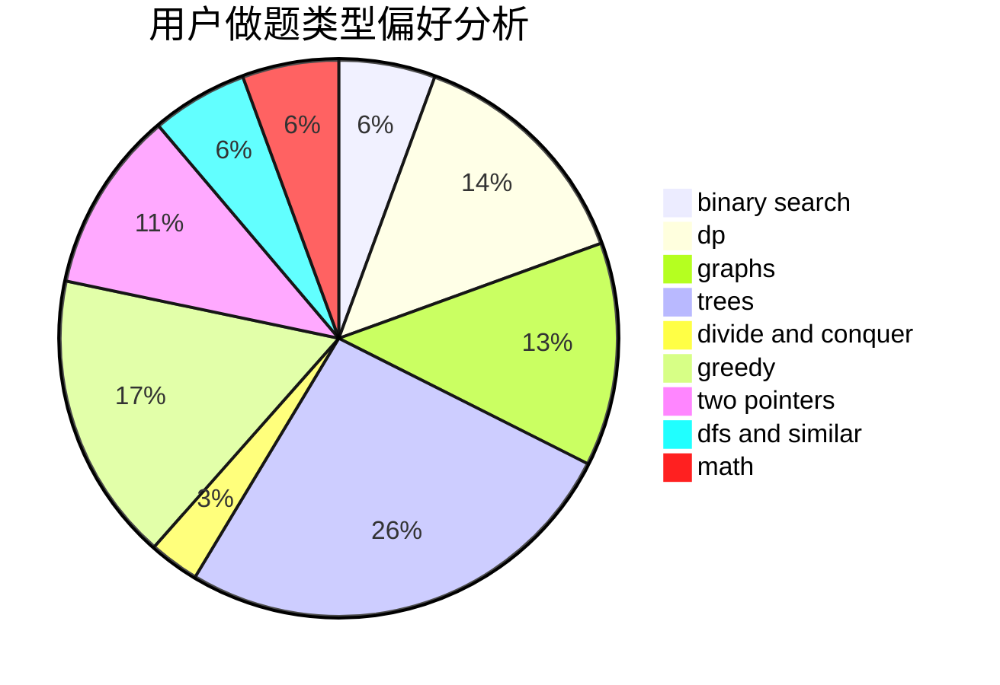

# jianfeng

<!-- tabs:start -->

#### **用户提交结果分析**

#### **用户做题类型偏好分析**

<!-- tabs:end -->
# 推荐题目
[825E](https://codeforces.com/contest/825/problem/E)
[1194E](https://codeforces.com/contest/1194/problem/E)
[851D](https://codeforces.com/contest/851/problem/D)
[198E](https://codeforces.com/contest/198/problem/E)
[602A](https://codeforces.com/contest/602/problem/A)
[1051D](https://codeforces.com/contest/1051/problem/D)
[12042](https://codeforces.com/contest/1204/problem/2)
[1250L](https://codeforces.com/contest/1250/problem/L)
[232B](https://codeforces.com/contest/232/problem/B)
[34A](https://codeforces.com/contest/34/problem/A)
