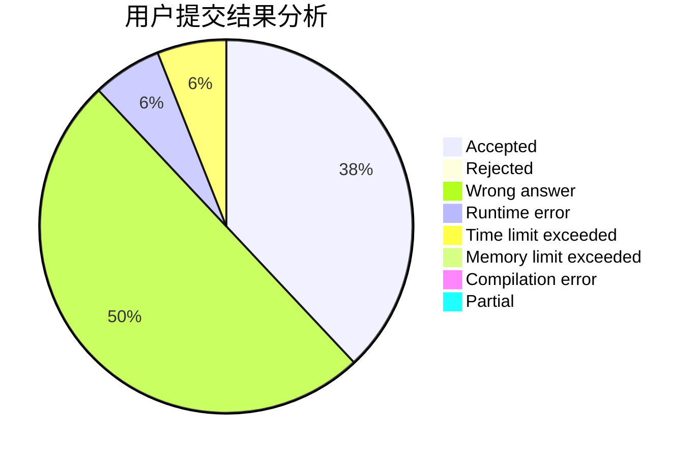
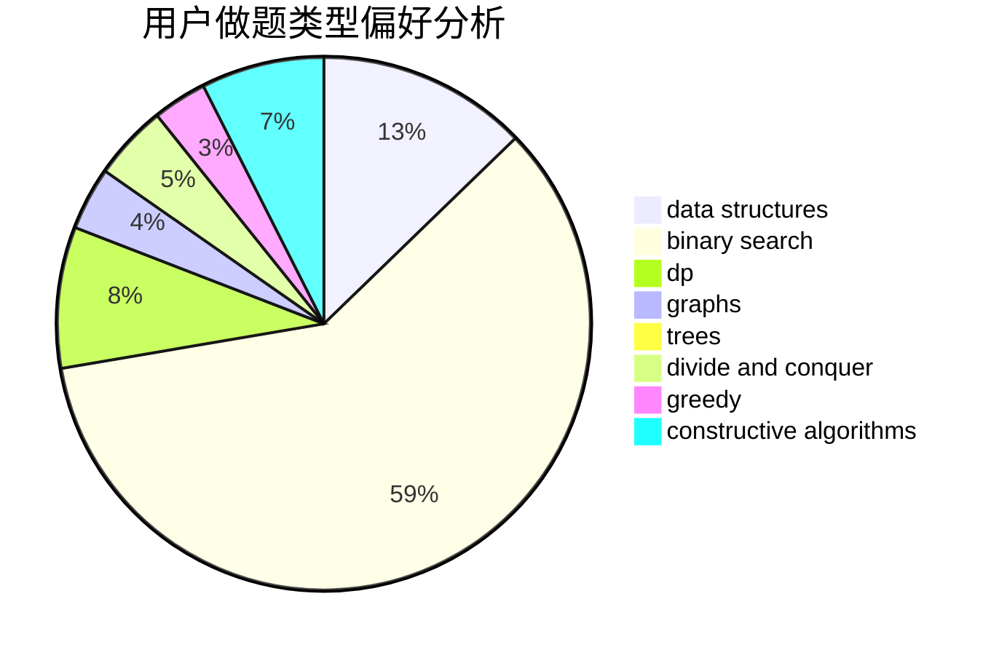
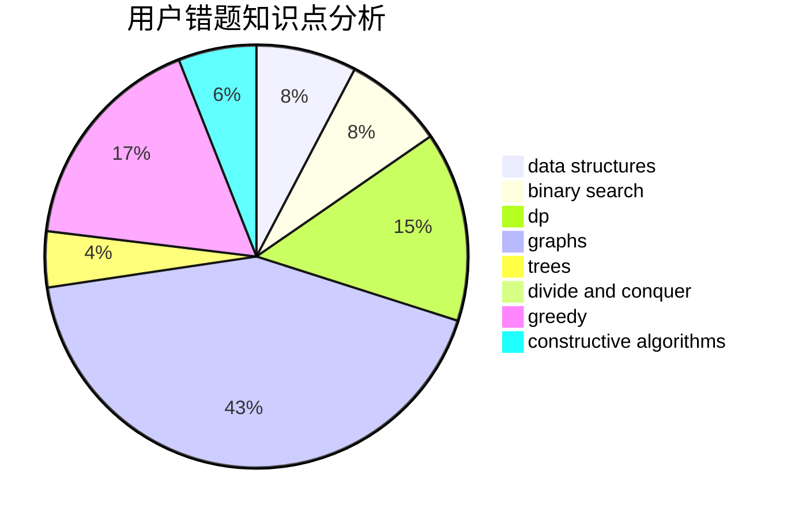

# 12cow

<!-- tabs:start -->

#### **用户提交结果分析**

#### **用户做题类型偏好分析**

#### **用户错题知识点分析**

<!-- tabs:end -->
# 推荐题目
[1130B](https://codeforces.com/contest/1130/problem/B)		greedy		  
[1061E](https://codeforces.com/contest/1061/problem/E)		flows,
                        graphs		  
[1118F2](https://codeforces.com/contest/1118F/problem/2)		combinatorics,
                        dfs and similar,
                        dp,
                        trees		  
[1119C](https://codeforces.com/contest/1119/problem/C)		constructive algorithms,
                        greedy,
                        implementation,
                        math		  
[1119H](https://codeforces.com/contest/1119/problem/H)		fft,
                        math		  
[1081A](https://codeforces.com/contest/1081/problem/A)		constructive algorithms,
                        math		  
[1129A2](https://codeforces.com/contest/1129A/problem/2)		brute force,
                        greedy		  
[1129D](https://codeforces.com/contest/1129/problem/D)		data structures,
                        dp		  
[1120F](https://codeforces.com/contest/1120/problem/F)		data structures,
                        dp,
                        greedy		  
[1129B](https://codeforces.com/contest/1129/problem/B)		constructive algorithms		  
