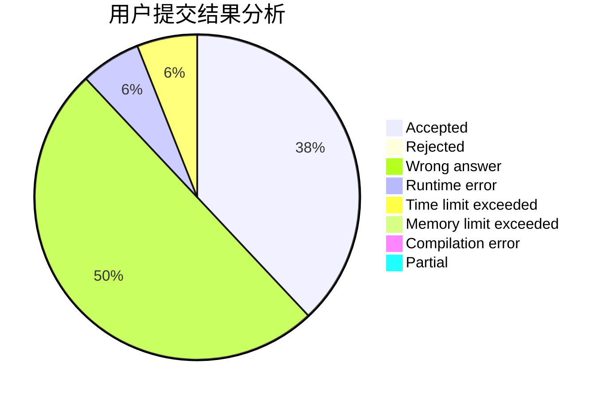
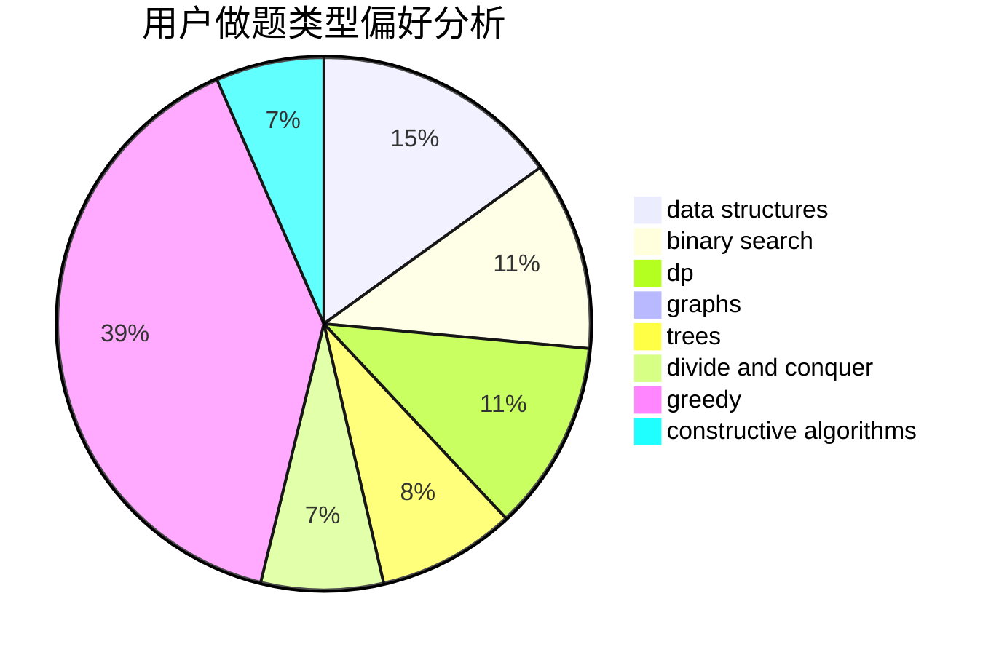
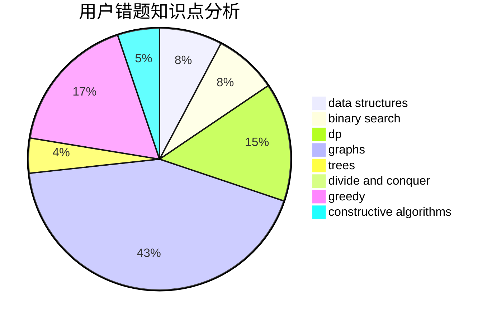

# 12cow

<!-- tabs:start -->

#### **用户提交结果分析**

#### **用户做题类型偏好分析**

#### **用户错题知识点分析**

<!-- tabs:end -->
# 推荐题目
[1132B](https://codeforces.com/contest/1132/problem/B)		greedy,
                        sortings		  
[1062B](https://codeforces.com/contest/1062/problem/B)		greedy,
                        math,
                        number theory		  
[1120F](https://codeforces.com/contest/1120/problem/F)		data structures,
                        dp,
                        greedy		  
[1121C](https://codeforces.com/contest/1121/problem/C)		implementation		  
[1129D](https://codeforces.com/contest/1129/problem/D)		data structures,
                        dp		  
[1081D](https://codeforces.com/contest/1081/problem/D)		dsu,
                        graphs,
                        shortest paths,
                        sortings		  
[1131A](https://codeforces.com/contest/1131/problem/A)		math		  
[1131D](https://codeforces.com/contest/1131/problem/D)		dfs and similar,
                        dp,
                        dsu,
                        graphs,
                        greedy		  
[11302](https://codeforces.com/contest/1130/problem/2)		dsu,graphs,sortings,trees		  
[1131B](https://codeforces.com/contest/1131/problem/B)		greedy,
                        implementation		  
