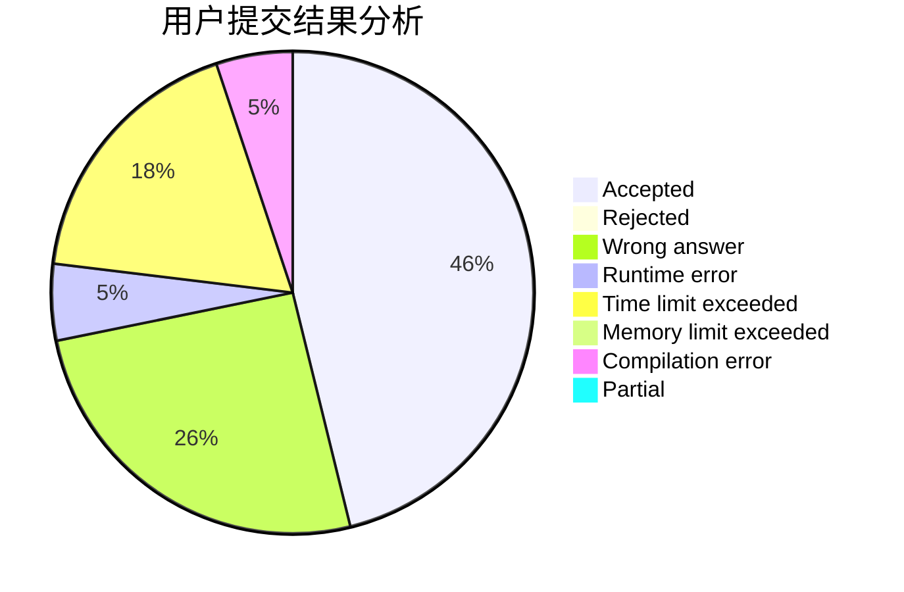
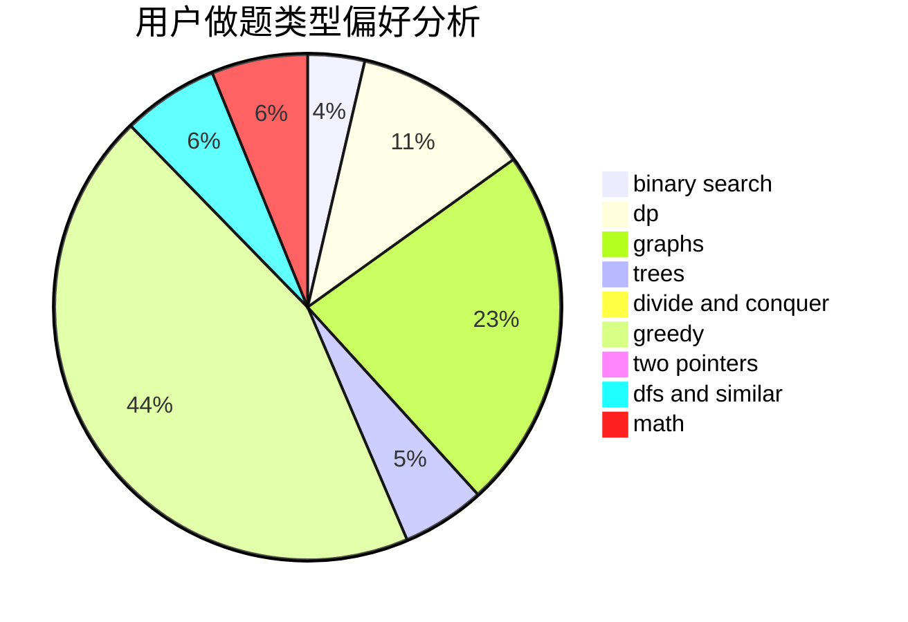

# Bebest

<!-- tabs:start -->

#### **用户提交结果分析**

#### **用户做题类型偏好分析**

<!-- tabs:end -->
# 推荐题目
[1458A](https://codeforces.com/contest/1458/problem/A)
[1114A](https://codeforces.com/contest/1114/problem/A)
[538B](https://codeforces.com/contest/538/problem/B)
[535C](https://codeforces.com/contest/535/problem/C)
[320B](https://codeforces.com/contest/320/problem/B)
[536D](https://codeforces.com/contest/536/problem/D)
[535E](https://codeforces.com/contest/535/problem/E)
[534B](https://codeforces.com/contest/534/problem/B)
[535B](https://codeforces.com/contest/535/problem/B)
[1078E](https://codeforces.com/contest/1078/problem/E)
