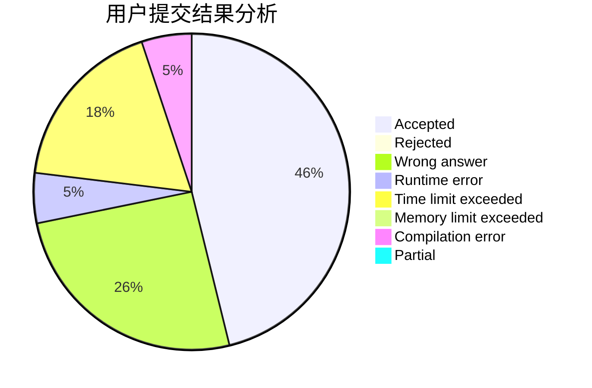
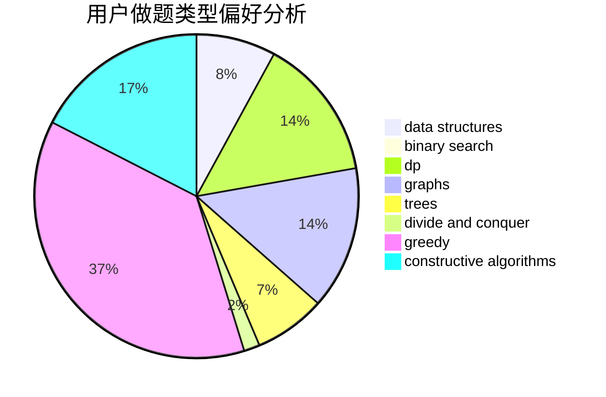

# Bebest

<!-- tabs:start -->

#### **用户提交结果分析**

#### **用户做题类型偏好分析**

#### **用户错题知识点分析**

<!-- tabs:end -->
# 推荐题目
[1458A](https://codeforces.com/contest/1458/problem/A)		math,
                        number theory		  
[1114A](https://codeforces.com/contest/1114/problem/A)		brute force,
                        greedy,
                        implementation		  
[538B](https://codeforces.com/contest/538/problem/B)		constructive algorithms,
                        dp,
                        greedy,
                        implementation		  
[535C](https://codeforces.com/contest/535/problem/C)		binary search,
                        greedy,
                        math		  
[320B](https://codeforces.com/contest/320/problem/B)		dfs and similar,
                        graphs		  
[536D](https://codeforces.com/contest/536/problem/D)		dp,
                        games		  
[535E](https://codeforces.com/contest/535/problem/E)		geometry,
                        math		  
[534B](https://codeforces.com/contest/534/problem/B)		dp,
                        greedy,
                        math		  
[535B](https://codeforces.com/contest/535/problem/B)		bitmasks,
                        brute force,
                        combinatorics,
                        implementation		  
[1078E](https://codeforces.com/contest/1078/problem/E)		constructive algorithms		  
