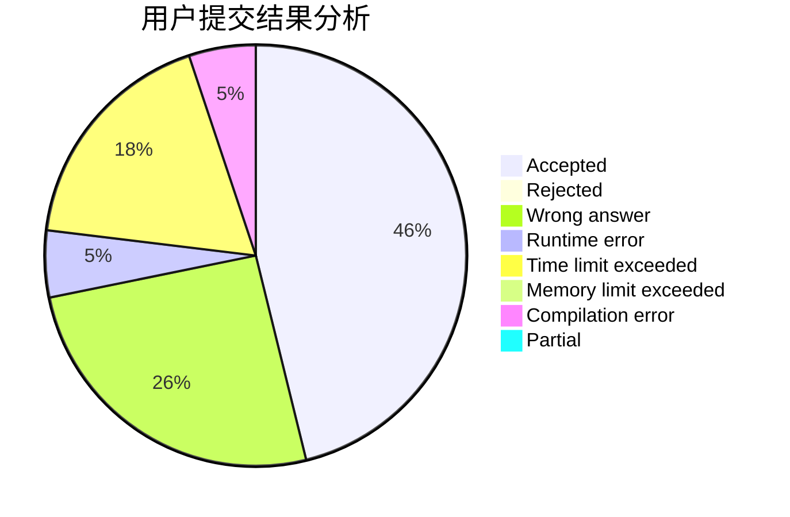
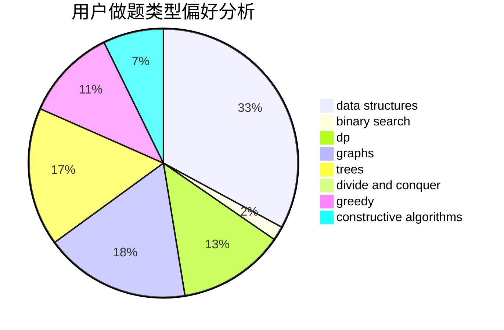

# Bebest

<!-- tabs:start -->

#### **用户提交结果分析**

#### **用户做题类型偏好分析**

#### **用户错题知识点分析**

<!-- tabs:end -->
# 推荐题目
[144D](https://codeforces.com/contest/144/problem/D)		data structures,
                        dfs and similar,
                        graphs,
                        shortest paths		  
[1113C](https://codeforces.com/contest/1113/problem/C)		dsu,graphs,sortings,trees		  
[513B2](https://codeforces.com/contest/513B/problem/2)		bitmasks,
                        divide and conquer,
                        math		  
[512C](https://codeforces.com/contest/512/problem/C)		dsu,graphs,sortings,trees		  
[301D](https://codeforces.com/contest/301/problem/D)		data structures		  
[513A](https://codeforces.com/contest/513/problem/A)		constructive algorithms,
                        math		  
[512E](https://codeforces.com/contest/512/problem/E)		constructive algorithms,
                        divide and conquer		  
[510D](https://codeforces.com/contest/510/problem/D)		bitmasks,
                        brute force,
                        dp,
                        math		  
[512B](https://codeforces.com/contest/512/problem/B)		dsu,graphs,sortings,trees		  
[1078B](https://codeforces.com/contest/1078/problem/B)		dsu,graphs,sortings,trees		  
