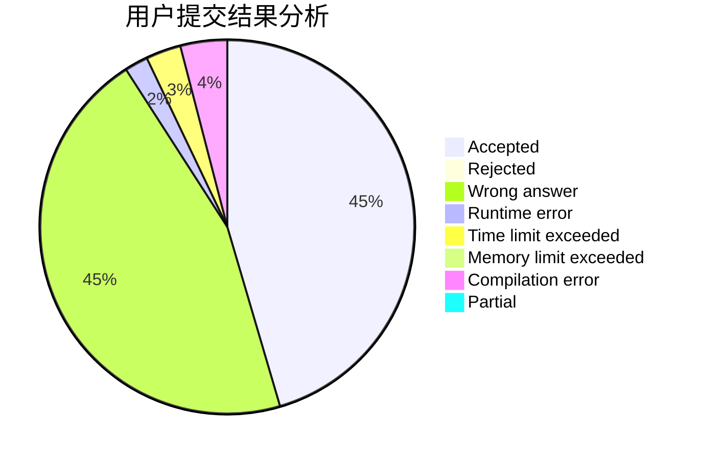
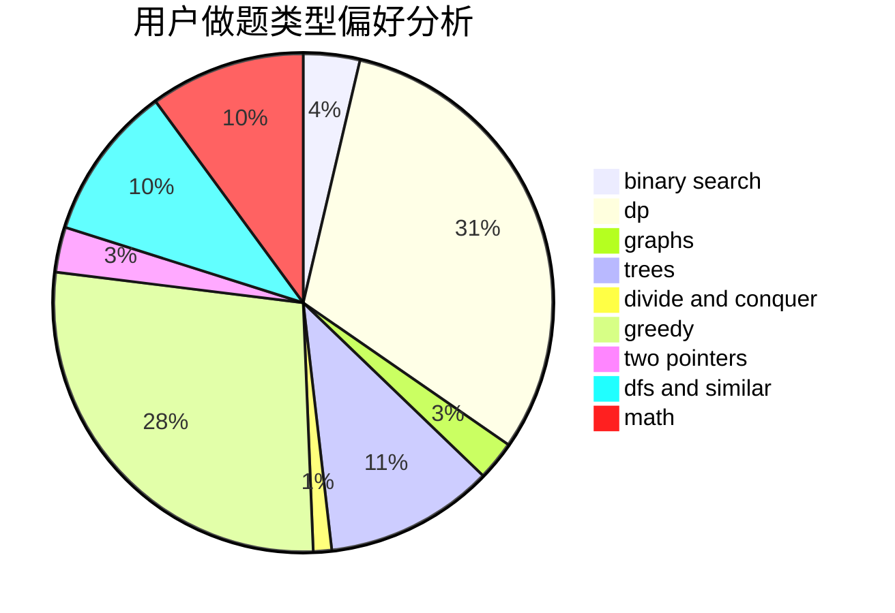

# jiang4869

<!-- tabs:start -->

#### **用户提交结果分析**

#### **用户做题类型偏好分析**

<!-- tabs:end -->
# 推荐题目
[478B](https://codeforces.com/contest/478/problem/B)
[455D](https://codeforces.com/contest/455/problem/D)
[1073D](https://codeforces.com/contest/1073/problem/D)
[814D](https://codeforces.com/contest/814/problem/D)
[10C](https://codeforces.com/contest/10/problem/C)
[376A](https://codeforces.com/contest/376/problem/A)
[71B](https://codeforces.com/contest/71/problem/B)
[312C](https://codeforces.com/contest/312/problem/C)
[781D](https://codeforces.com/contest/781/problem/D)
[1032D](https://codeforces.com/contest/1032/problem/D)
