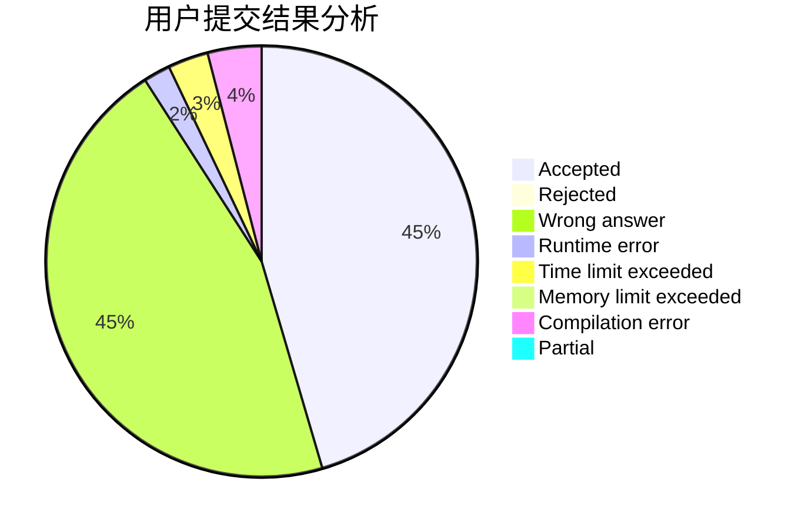
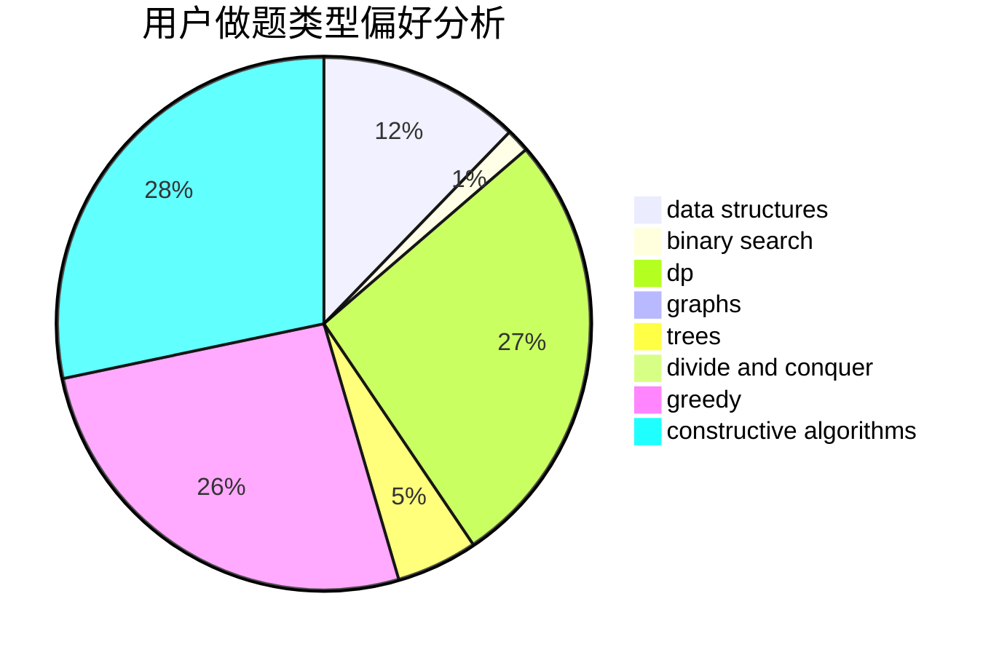
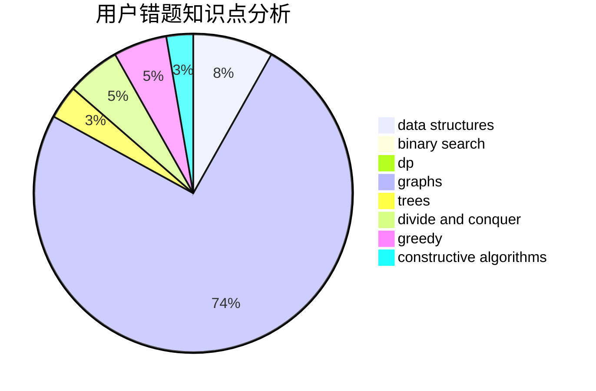

# jiang4869

<!-- tabs:start -->

#### **用户提交结果分析**

#### **用户做题类型偏好分析**

#### **用户错题知识点分析**

<!-- tabs:end -->
# 推荐题目
[478B](https://codeforces.com/contest/478/problem/B)		combinatorics,
                        constructive algorithms,
                        greedy,
                        math		  
[455D](https://codeforces.com/contest/455/problem/D)		data structures		  
[1073D](https://codeforces.com/contest/1073/problem/D)		binary search,
                        brute force,
                        data structures,
                        greedy		  
[814D](https://codeforces.com/contest/814/problem/D)		dfs and similar,
                        dp,
                        geometry,
                        greedy,
                        trees		  
[10C](https://codeforces.com/contest/10/problem/C)		number theory		  
[376A](https://codeforces.com/contest/376/problem/A)		implementation,
                        math		  
[71B](https://codeforces.com/contest/71/problem/B)		implementation,
                        math		  
[312C](https://codeforces.com/contest/312/problem/C)		dsu,graphs,sortings,trees		  
[781D](https://codeforces.com/contest/781/problem/D)		dsu,graphs,sortings,trees		  
[1032D](https://codeforces.com/contest/1032/problem/D)		geometry,
                        implementation		  
