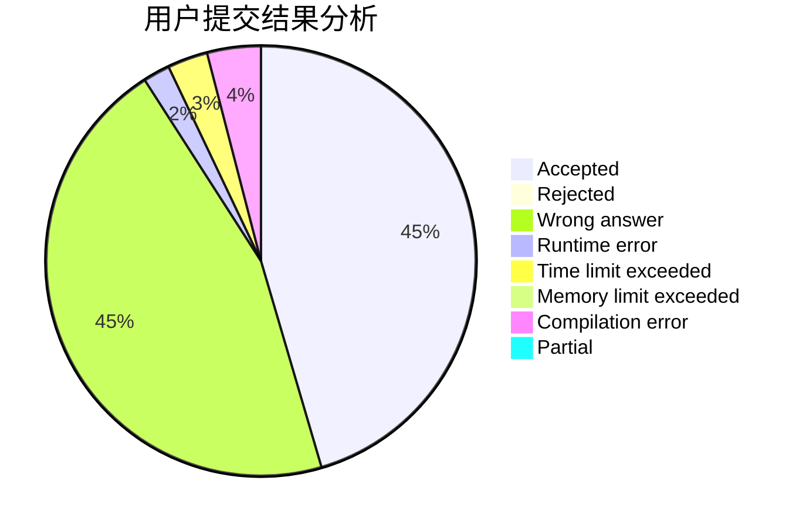
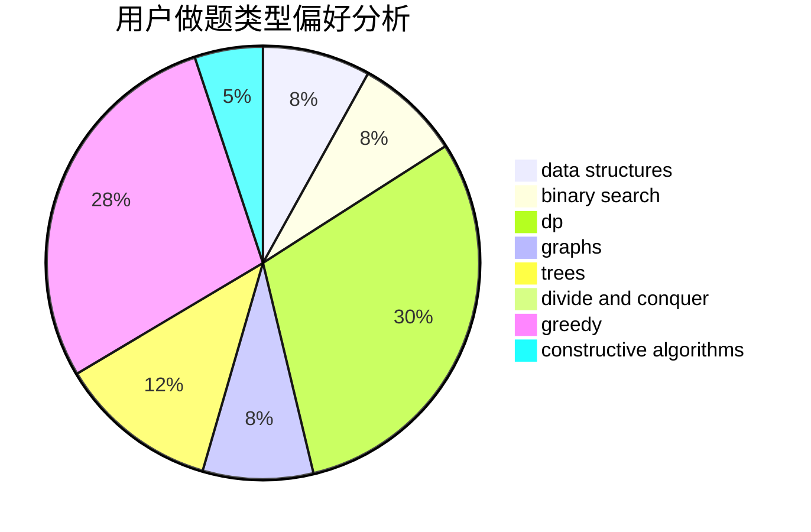
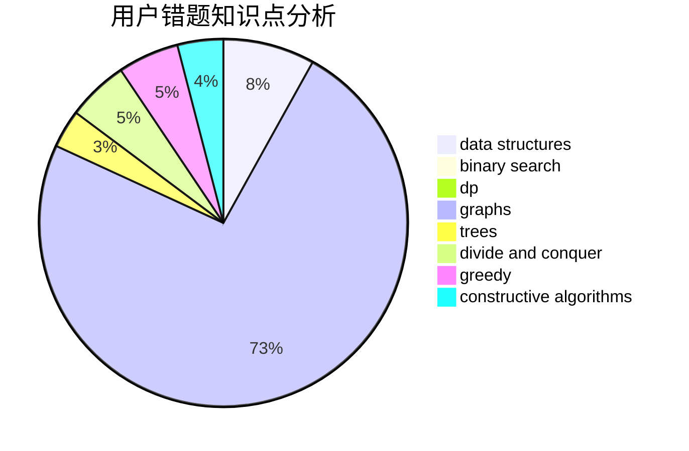

# jiang4869

<!-- tabs:start -->

#### **用户提交结果分析**

#### **用户做题类型偏好分析**

#### **用户错题知识点分析**

<!-- tabs:end -->
# 推荐题目
[459C](https://codeforces.com/contest/459/problem/C)		combinatorics,
                        constructive algorithms,
                        math		  
[434E](https://codeforces.com/contest/434/problem/E)		binary search,
                        divide and conquer,
                        sortings,
                        trees		  
[1073A](https://codeforces.com/contest/1073/problem/A)		implementation,
                        strings		  
[7C](https://codeforces.com/contest/7/problem/C)		math,
                        number theory		  
[109A](https://codeforces.com/contest/109/problem/A)		brute force,
                        implementation		  
[349B](https://codeforces.com/contest/349/problem/B)		data structures,
                        dp,
                        greedy,
                        implementation		  
[701E](https://codeforces.com/contest/701/problem/E)		dsu,graphs,sortings,trees		  
[295E](https://codeforces.com/contest/295/problem/E)		data structures		  
[762F](https://codeforces.com/contest/762/problem/F)		combinatorics,
                        graphs,
                        trees		  
[1031B](https://codeforces.com/contest/1031/problem/B)		nan		  
