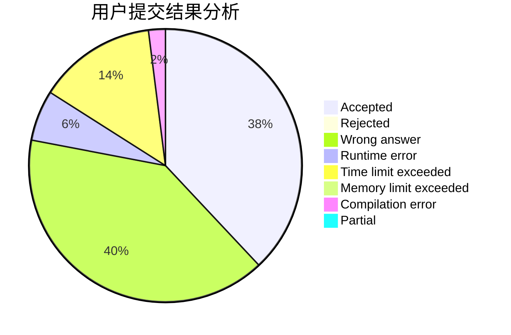
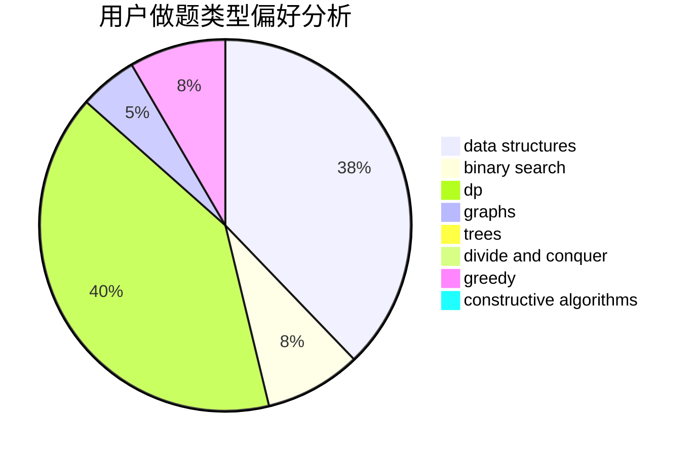

# jiangIy

<!-- tabs:start -->

#### **用户提交结果分析**

#### **用户做题类型偏好分析**

#### **用户错题知识点分析**

<!-- tabs:end -->
# 推荐题目
[1392D](https://codeforces.com/contest/1392/problem/D)		dp,
                        greedy		  
[163A](https://codeforces.com/contest/163/problem/A)		dp		  
[1168C](https://codeforces.com/contest/1168/problem/C)		bitmasks,
                        dp		  
[1248C](https://codeforces.com/contest/1248/problem/C)		dsu,graphs,sortings,trees		  
[12102](https://codeforces.com/contest/1210/problem/2)		dsu,graphs,sortings,trees		  
[813E](https://codeforces.com/contest/813/problem/E)		binary search,
                        data structures		  
[523D](https://codeforces.com/contest/523/problem/D)		*special problem,
                        data structures,
                        implementation		  
[1155F](https://codeforces.com/contest/1155/problem/F)		brute force,
                        dp,
                        graphs		  
[585D](https://codeforces.com/contest/585/problem/D)		meet-in-the-middle		  
[743A](https://codeforces.com/contest/743/problem/A)		constructive algorithms,
                        greedy,
                        implementation		  
