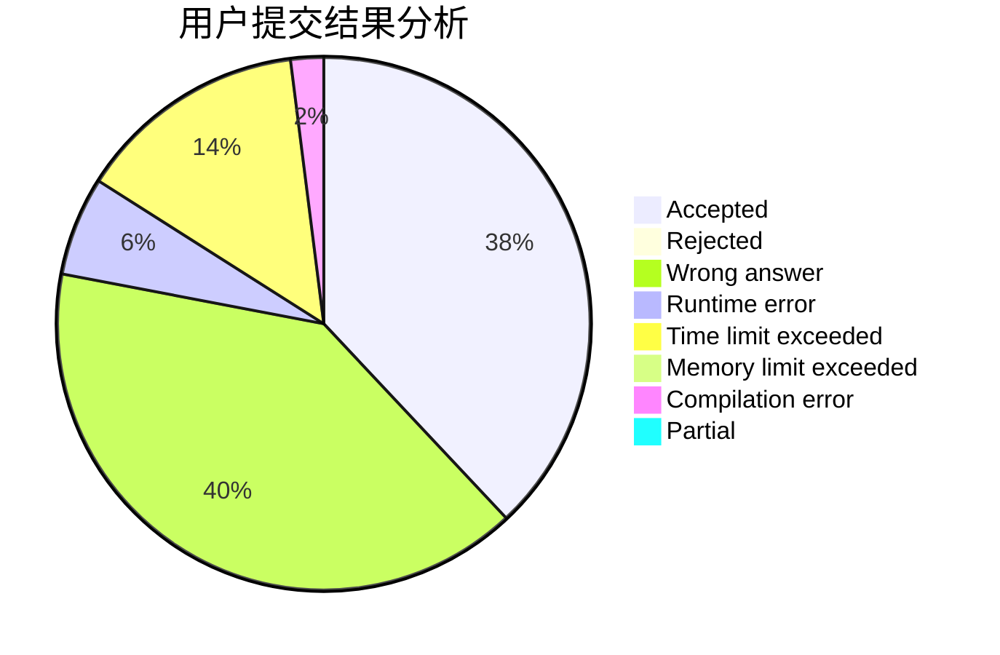
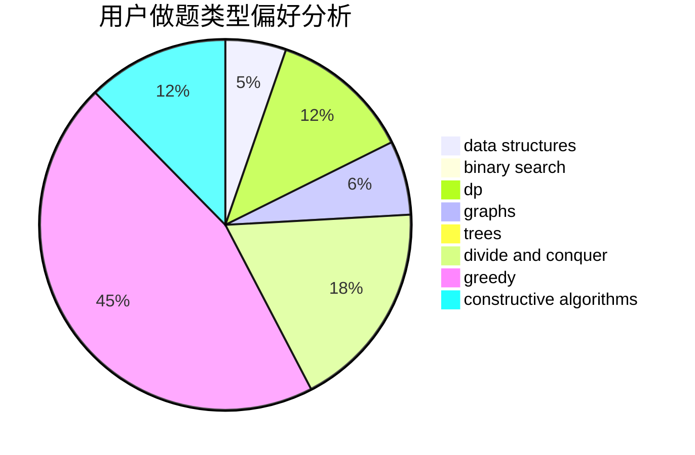
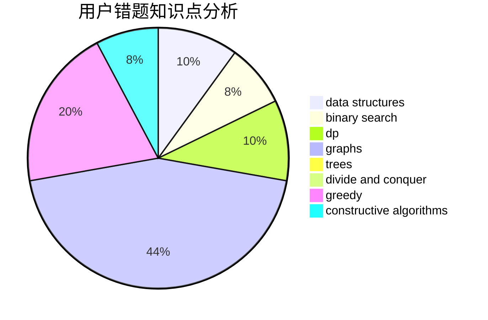

# jiangIy

<!-- tabs:start -->

#### **用户提交结果分析**

#### **用户做题类型偏好分析**

#### **用户错题知识点分析**

<!-- tabs:end -->
# 推荐题目
[1382B](https://codeforces.com/contest/1382/problem/B)		dp,
                        games		  
[1510A](https://codeforces.com/contest/1510/problem/A)		nan		  
[1165F2](https://codeforces.com/contest/1165F/problem/2)		binary search,
                        greedy,
                        implementation		  
[1243C](https://codeforces.com/contest/1243/problem/C)		dsu,graphs,sortings,trees		  
[1206A](https://codeforces.com/contest/1206/problem/A)		math,
                        sortings		  
[799E](https://codeforces.com/contest/799/problem/E)		data structures,
                        greedy,
                        two pointers		  
[501E](https://codeforces.com/contest/501/problem/E)		binary search,
                        combinatorics,
                        implementation		  
[1153F](https://codeforces.com/contest/1153/problem/F)		combinatorics,
                        dp,
                        math,
                        probabilities		  
[566E](https://codeforces.com/contest/566/problem/E)		bitmasks,
                        constructive algorithms,
                        trees		  
[725B](https://codeforces.com/contest/725/problem/B)		implementation,
                        math		  
