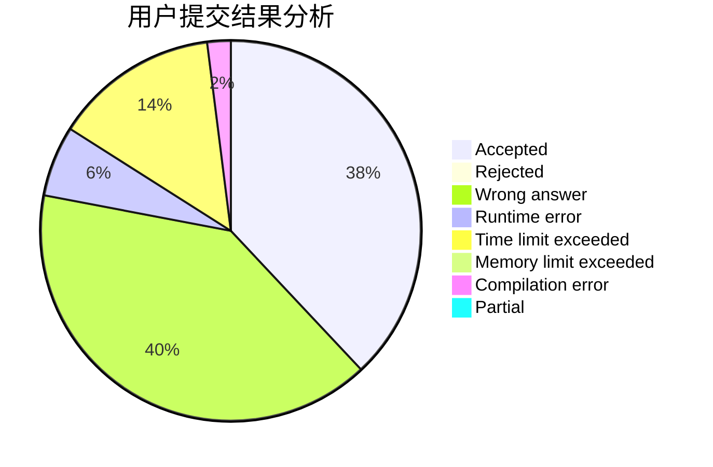
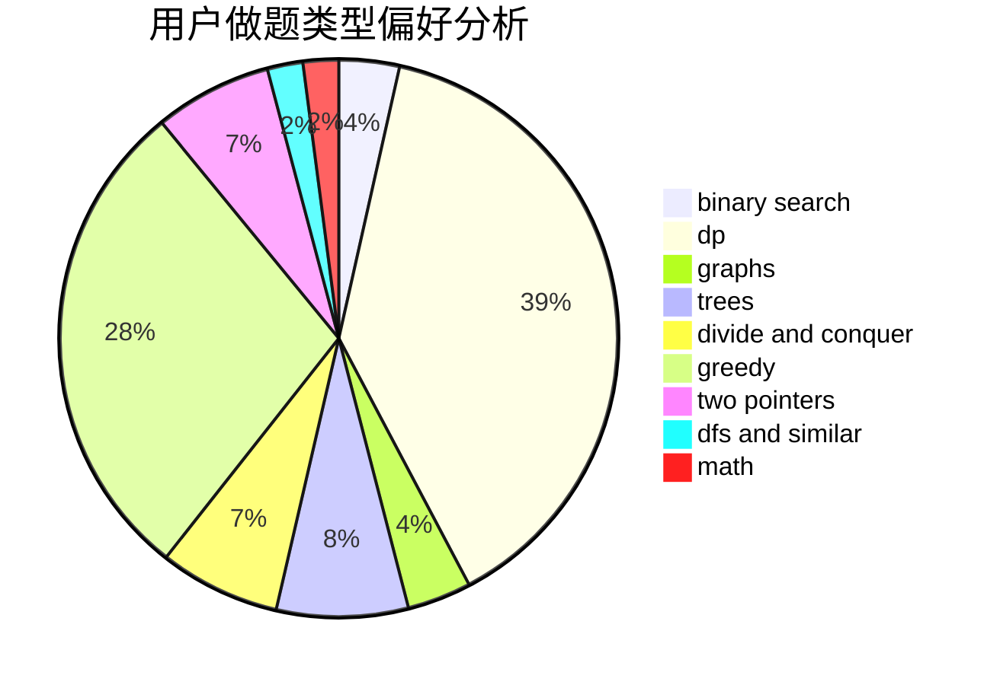

# jiangIy

<!-- tabs:start -->

#### **用户提交结果分析**

#### **用户做题类型偏好分析**

<!-- tabs:end -->
# 推荐题目
[1392D](https://codeforces.com/contest/1392/problem/D)
[163A](https://codeforces.com/contest/163/problem/A)
[1168C](https://codeforces.com/contest/1168/problem/C)
[1248C](https://codeforces.com/contest/1248/problem/C)
[12102](https://codeforces.com/contest/1210/problem/2)
[813E](https://codeforces.com/contest/813/problem/E)
[523D](https://codeforces.com/contest/523/problem/D)
[1155F](https://codeforces.com/contest/1155/problem/F)
[585D](https://codeforces.com/contest/585/problem/D)
[743A](https://codeforces.com/contest/743/problem/A)
