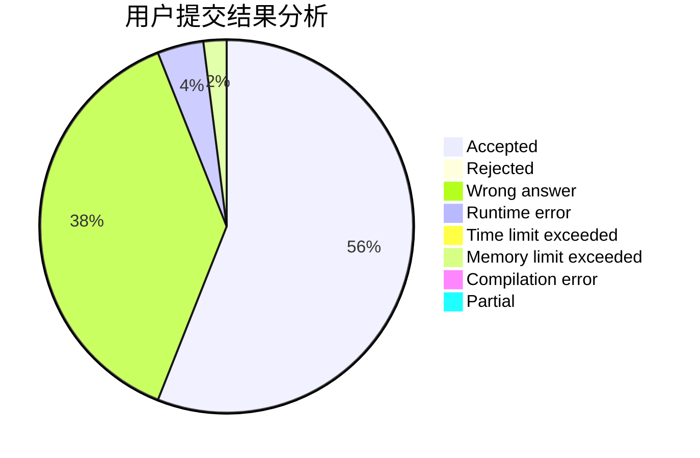
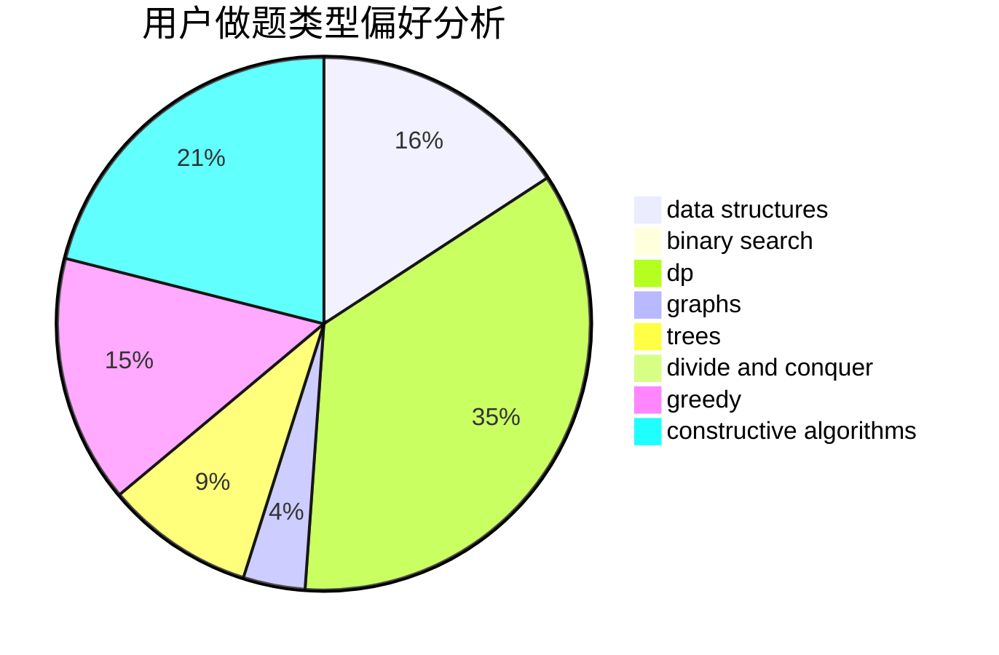
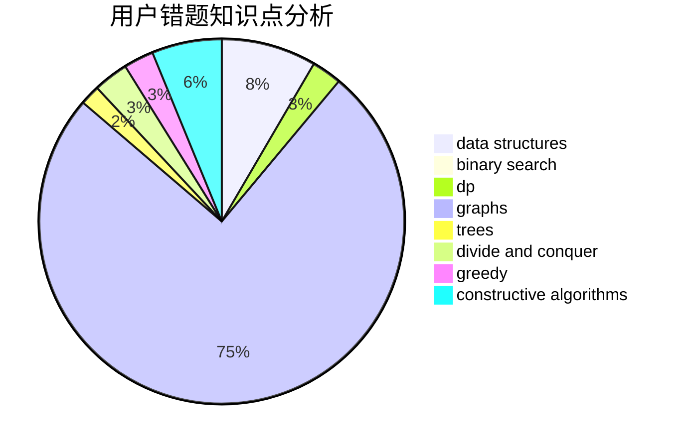

# jiang_jiang

<!-- tabs:start -->

#### **用户提交结果分析**

#### **用户做题类型偏好分析**

#### **用户错题知识点分析**

<!-- tabs:end -->
# 推荐题目
[590E](https://codeforces.com/contest/590/problem/E)		graph matchings,
                        strings		  
[319C](https://codeforces.com/contest/319/problem/C)		dp,
                        geometry		  
[710B](https://codeforces.com/contest/710/problem/B)		brute force,
                        sortings		  
[277E](https://codeforces.com/contest/277/problem/E)		flows,
                        trees		  
[7E](https://codeforces.com/contest/7/problem/E)		dp,
                        expression parsing,
                        implementation		  
[614D](https://codeforces.com/contest/614/problem/D)		dsu,graphs,sortings,trees		  
[688A](https://codeforces.com/contest/688/problem/A)		implementation		  
[789A](https://codeforces.com/contest/789/problem/A)		implementation,
                        math		  
[1197E](https://codeforces.com/contest/1197/problem/E)		binary search,
                        combinatorics,
                        data structures,
                        dp,
                        shortest paths,
                        sortings		  
[228B](https://codeforces.com/contest/228/problem/B)		brute force,
                        implementation		  
