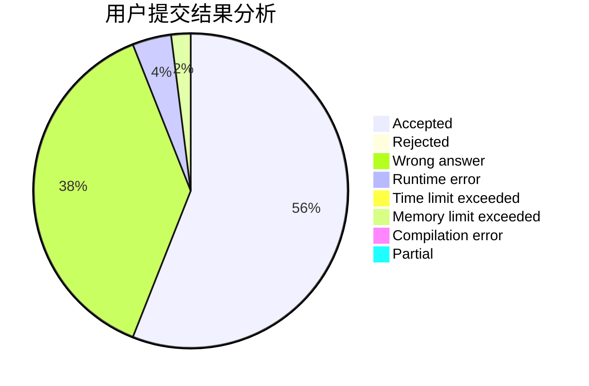
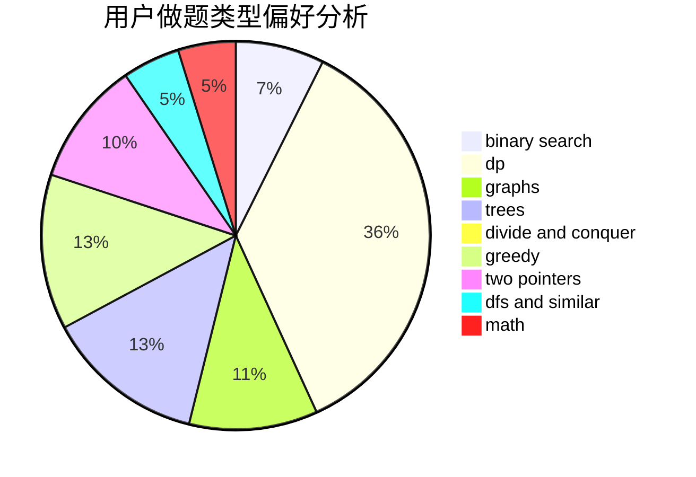

# jiang_jiang

<!-- tabs:start -->

#### **用户提交结果分析**

#### **用户做题类型偏好分析**

<!-- tabs:end -->
# 推荐题目
[590E](https://codeforces.com/contest/590/problem/E)
[319C](https://codeforces.com/contest/319/problem/C)
[710B](https://codeforces.com/contest/710/problem/B)
[277E](https://codeforces.com/contest/277/problem/E)
[7E](https://codeforces.com/contest/7/problem/E)
[614D](https://codeforces.com/contest/614/problem/D)
[688A](https://codeforces.com/contest/688/problem/A)
[789A](https://codeforces.com/contest/789/problem/A)
[1197E](https://codeforces.com/contest/1197/problem/E)
[228B](https://codeforces.com/contest/228/problem/B)
