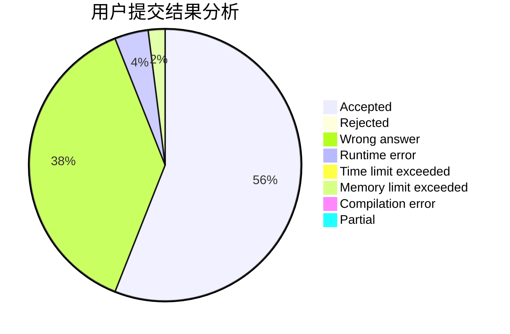
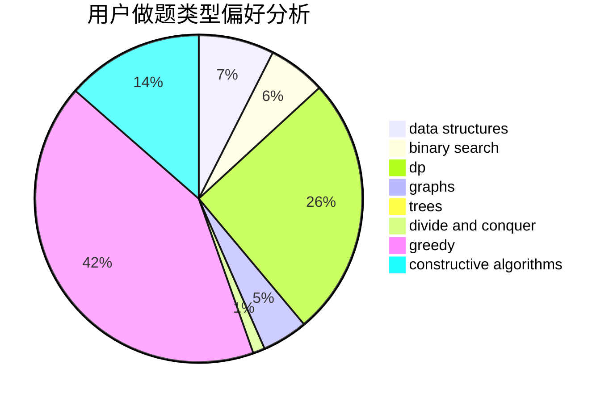
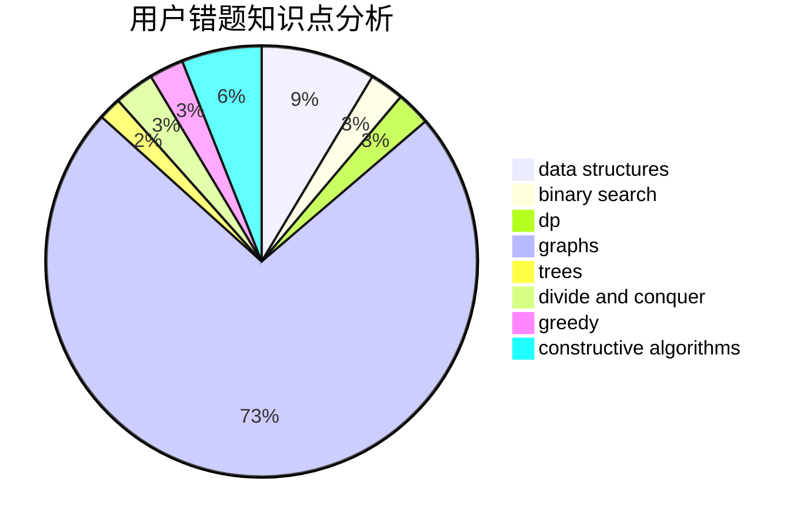

# jiang_jiang

<!-- tabs:start -->

#### **用户提交结果分析**

#### **用户做题类型偏好分析**

#### **用户错题知识点分析**

<!-- tabs:end -->
# 推荐题目
[570C](https://codeforces.com/contest/570/problem/C)		constructive algorithms,
                        data structures,
                        implementation		  
[300E](https://codeforces.com/contest/300/problem/E)		binary search,
                        math,
                        number theory		  
[690A1](https://codeforces.com/contest/690A/problem/1)		nan		  
[25E](https://codeforces.com/contest/25/problem/E)		hashing,
                        strings		  
[782A](https://codeforces.com/contest/782/problem/A)		dsu,graphs,sortings,trees		  
[597C](https://codeforces.com/contest/597/problem/C)		data structures,
                        dp		  
[666D](https://codeforces.com/contest/666/problem/D)		brute force,
                        geometry		  
[769A](https://codeforces.com/contest/769/problem/A)		*special problem,
                        implementation,
                        sortings		  
[1191F](https://codeforces.com/contest/1191/problem/F)		dsu,graphs,sortings,trees		  
[204C](https://codeforces.com/contest/204/problem/C)		math,
                        probabilities		  
