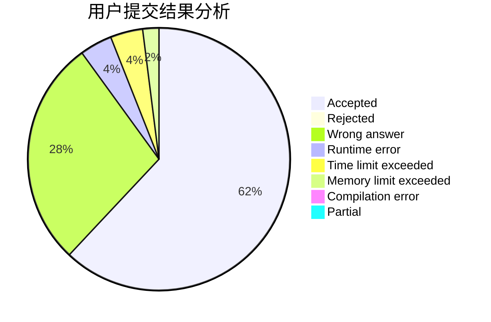
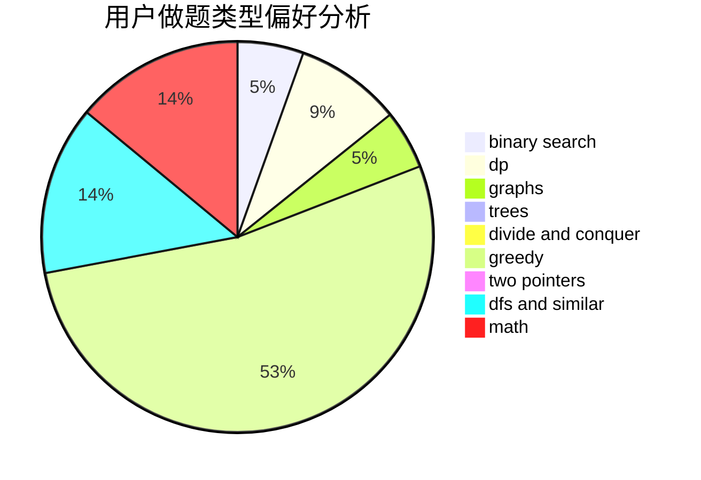

# jiangly

<!-- tabs:start -->

#### **用户提交结果分析**

#### **用户做题类型偏好分析**

<!-- tabs:end -->
# 推荐题目
[149E](https://codeforces.com/contest/149/problem/E)
[304D](https://codeforces.com/contest/304/problem/D)
[603B](https://codeforces.com/contest/603/problem/B)
[895B](https://codeforces.com/contest/895/problem/B)
[827D](https://codeforces.com/contest/827/problem/D)
[482A](https://codeforces.com/contest/482/problem/A)
[734A](https://codeforces.com/contest/734/problem/A)
[486B](https://codeforces.com/contest/486/problem/B)
[120H](https://codeforces.com/contest/120/problem/H)
[1103B](https://codeforces.com/contest/1103/problem/B)
