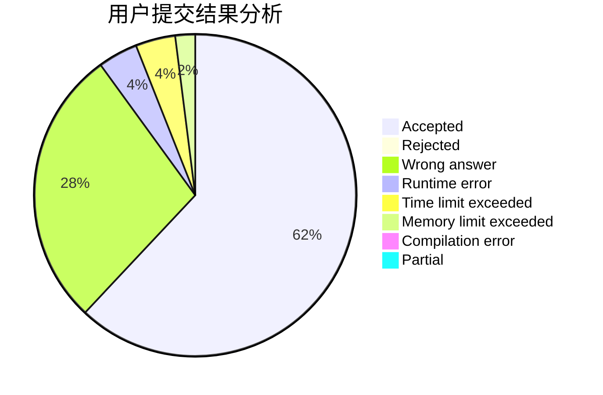
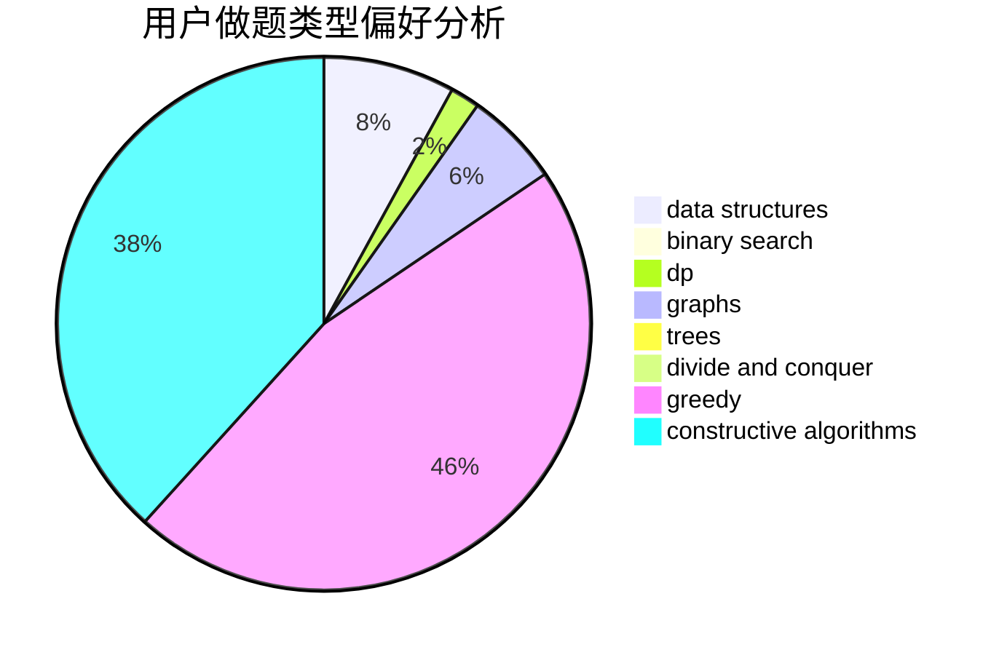

# jiangly

<!-- tabs:start -->

#### **用户提交结果分析**

#### **用户做题类型偏好分析**

#### **用户错题知识点分析**

<!-- tabs:end -->
# 推荐题目
[149E](https://codeforces.com/contest/149/problem/E)		string suffix structures,
                        strings		  
[304D](https://codeforces.com/contest/304/problem/D)		dsu,graphs,sortings,trees		  
[603B](https://codeforces.com/contest/603/problem/B)		combinatorics,
                        dfs and similar,
                        dsu,
                        math,
                        number theory		  
[895B](https://codeforces.com/contest/895/problem/B)		binary search,
                        math,
                        sortings,
                        two pointers		  
[827D](https://codeforces.com/contest/827/problem/D)		data structures,
                        dfs and similar,
                        graphs,
                        trees		  
[482A](https://codeforces.com/contest/482/problem/A)		constructive algorithms,
                        greedy		  
[734A](https://codeforces.com/contest/734/problem/A)		implementation,
                        strings		  
[486B](https://codeforces.com/contest/486/problem/B)		greedy,
                        hashing,
                        implementation		  
[120H](https://codeforces.com/contest/120/problem/H)		graph matchings		  
[1103B](https://codeforces.com/contest/1103/problem/B)		binary search,
                        constructive algorithms,
                        interactive		  
