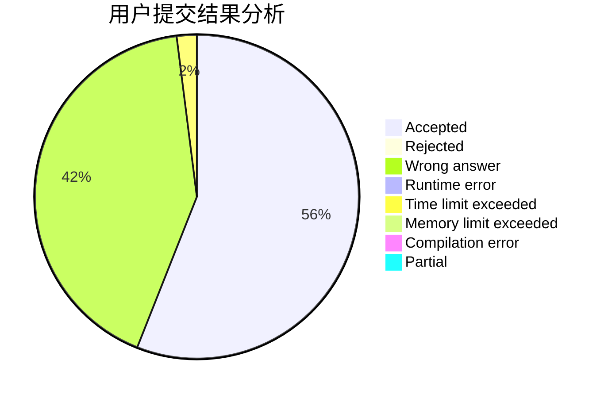
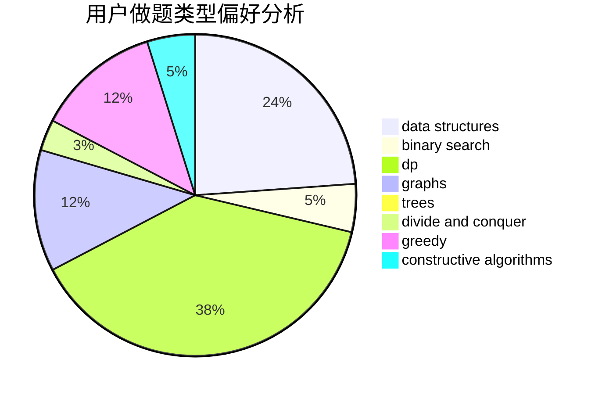
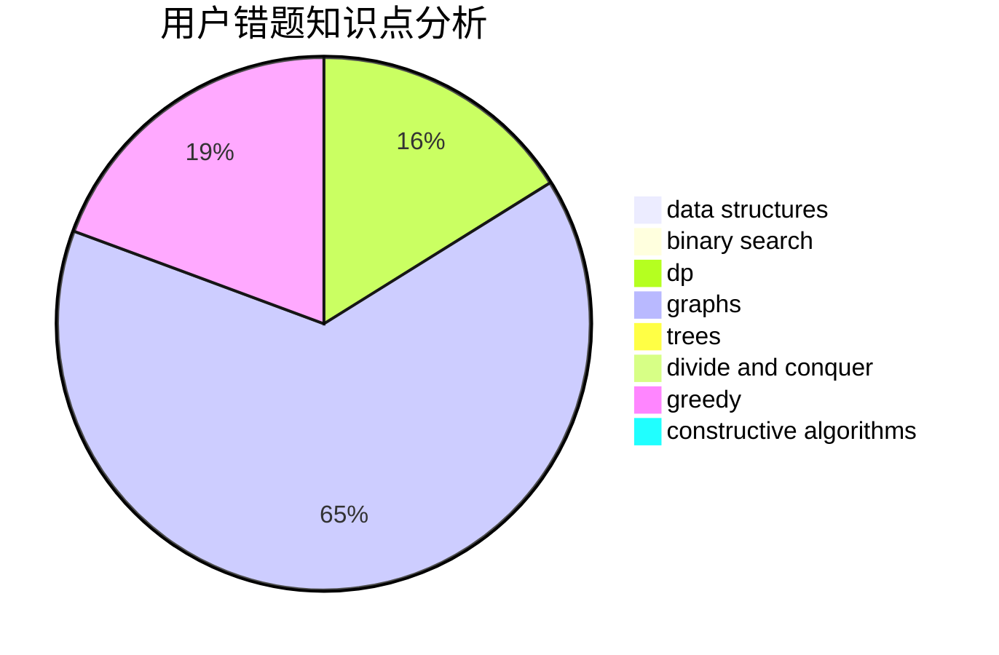

# jiangtaizhe001

<!-- tabs:start -->

#### **用户提交结果分析**

#### **用户做题类型偏好分析**

#### **用户错题知识点分析**

<!-- tabs:end -->
# 推荐题目
[993B](https://codeforces.com/contest/993/problem/B)		bitmasks,
                        brute force		  
[1325A](https://codeforces.com/contest/1325/problem/A)		constructive algorithms,
                        greedy,
                        number theory		  
[1450G](https://codeforces.com/contest/1450/problem/G)		bitmasks,
                        dp,
                        trees		  
[713C](https://codeforces.com/contest/713/problem/C)		dp,
                        sortings		  
[515A](https://codeforces.com/contest/515/problem/A)		math		  
[763D](https://codeforces.com/contest/763/problem/D)		data structures,
                        graphs,
                        hashing,
                        shortest paths,
                        trees		  
[67A](https://codeforces.com/contest/67/problem/A)		dp,
                        graphs,
                        greedy,
                        implementation		  
[1041F](https://codeforces.com/contest/1041/problem/F)		data structures,
                        divide and conquer,
                        dp,
                        math		  
[1103C](https://codeforces.com/contest/1103/problem/C)		constructive algorithms,
                        dfs and similar,
                        graphs,
                        math		  
[1091H](https://codeforces.com/contest/1091/problem/H)		games		  
