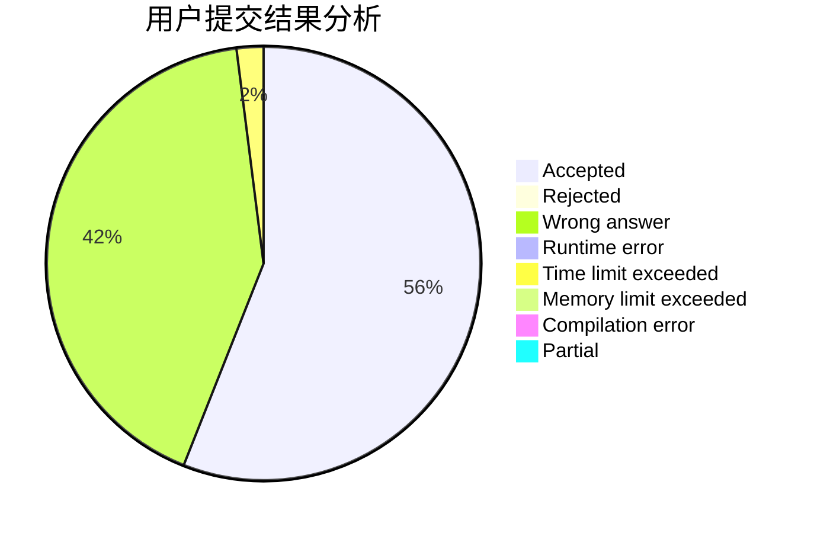
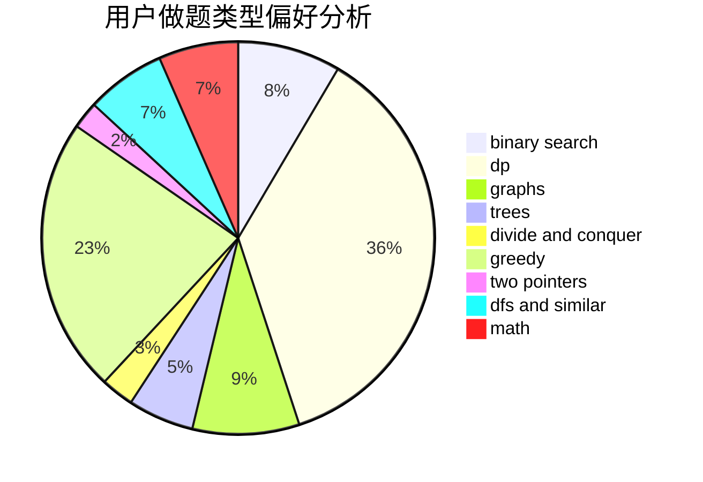

# jiangtaizhe001

<!-- tabs:start -->

#### **用户提交结果分析**

#### **用户做题类型偏好分析**

<!-- tabs:end -->
# 推荐题目
[993B](https://codeforces.com/contest/993/problem/B)
[1325A](https://codeforces.com/contest/1325/problem/A)
[1450G](https://codeforces.com/contest/1450/problem/G)
[713C](https://codeforces.com/contest/713/problem/C)
[515A](https://codeforces.com/contest/515/problem/A)
[763D](https://codeforces.com/contest/763/problem/D)
[67A](https://codeforces.com/contest/67/problem/A)
[1041F](https://codeforces.com/contest/1041/problem/F)
[1103C](https://codeforces.com/contest/1103/problem/C)
[1091H](https://codeforces.com/contest/1091/problem/H)
