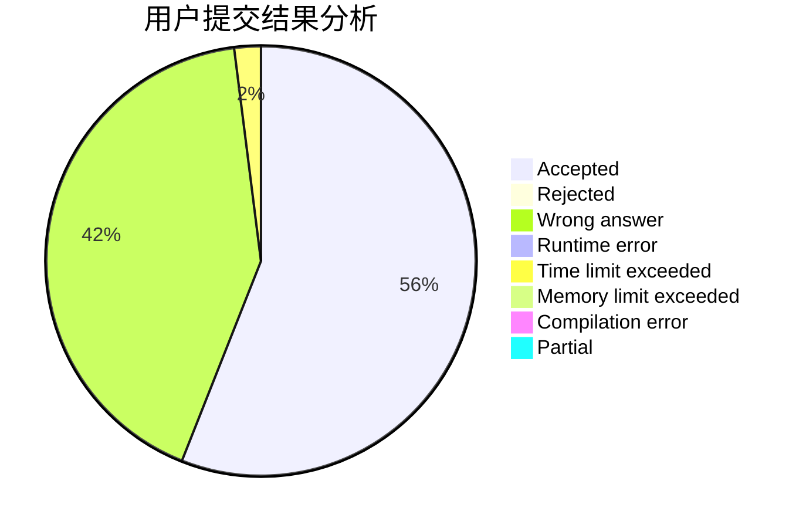
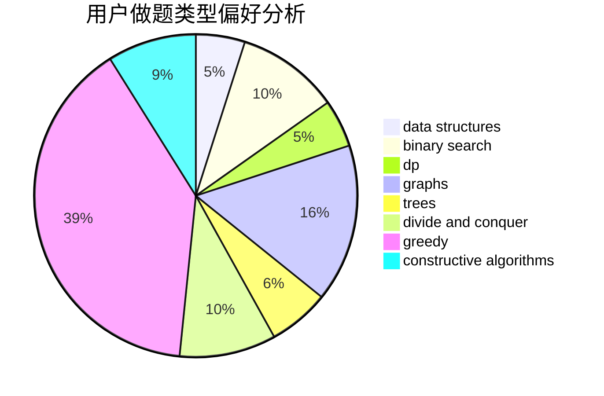
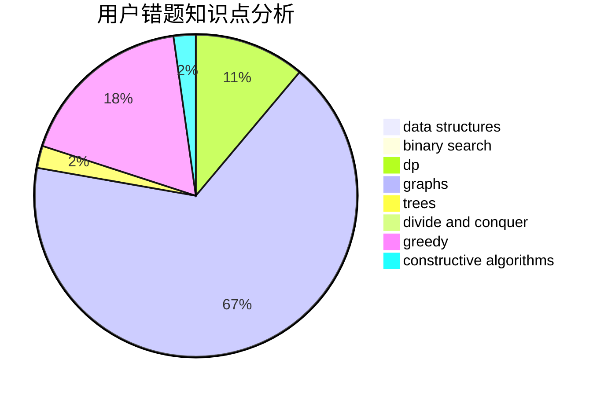

# jiangtaizhe001

<!-- tabs:start -->

#### **用户提交结果分析**

#### **用户做题类型偏好分析**

#### **用户错题知识点分析**

<!-- tabs:end -->
# 推荐题目
[979B](https://codeforces.com/contest/979/problem/B)		greedy		  
[1315B](https://codeforces.com/contest/1315/problem/B)		binary search,
                        dp,
                        greedy,
                        strings		  
[1439E](https://codeforces.com/contest/1439/problem/E)		bitmasks,
                        data structures,
                        games,
                        trees		  
[696D](https://codeforces.com/contest/696/problem/D)		data structures,
                        dp,
                        matrices,
                        strings		  
[494E](https://codeforces.com/contest/494/problem/E)		data structures,
                        games		  
[743C](https://codeforces.com/contest/743/problem/C)		brute force,
                        constructive algorithms,
                        math,
                        number theory		  
[659F](https://codeforces.com/contest/659/problem/F)		dfs and similar,
                        dsu,
                        graphs,
                        greedy,
                        sortings		  
[1041C](https://codeforces.com/contest/1041/problem/C)		binary search,
                        data structures,
                        greedy,
                        two pointers		  
[1102F](https://codeforces.com/contest/1102/problem/F)		binary search,
                        bitmasks,
                        brute force,
                        dp,
                        graphs		  
[1091E](https://codeforces.com/contest/1091/problem/E)		binary search,
                        data structures,
                        graphs,
                        greedy,
                        implementation,
                        math,
                        sortings		  
