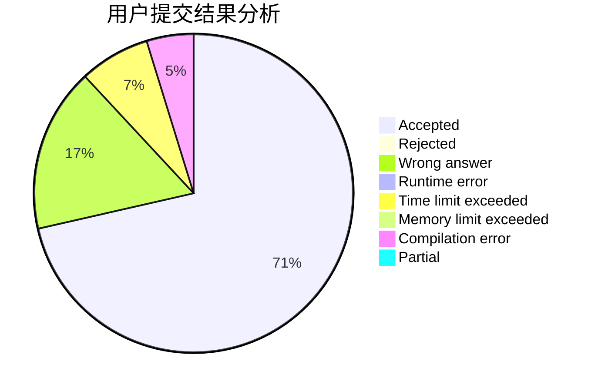
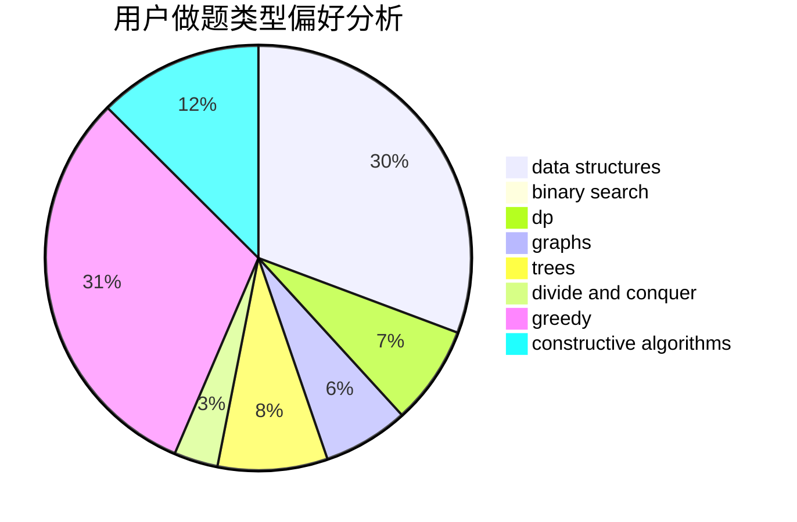
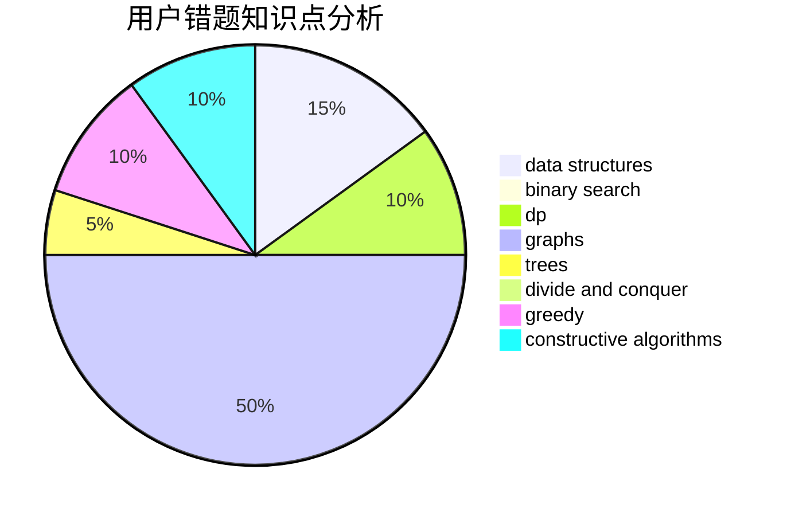

# jiawenzhuo

<!-- tabs:start -->

#### **用户提交结果分析**

#### **用户做题类型偏好分析**

#### **用户错题知识点分析**

<!-- tabs:end -->
# 推荐题目
[1292C](https://codeforces.com/contest/1292/problem/C)		combinatorics,
                        dfs and similar,
                        dp,
                        greedy,
                        trees		  
[1220E](https://codeforces.com/contest/1220/problem/E)		dfs and similar,
                        dp,
                        dsu,
                        graphs,
                        greedy,
                        trees		  
[863A](https://codeforces.com/contest/863/problem/A)		brute force,
                        implementation		  
[514D](https://codeforces.com/contest/514/problem/D)		binary search,
                        data structures,
                        two pointers		  
[1263B](https://codeforces.com/contest/1263/problem/B)		greedy,
                        implementation		  
[113B](https://codeforces.com/contest/113/problem/B)		brute force,
                        data structures,
                        hashing,
                        strings		  
[1168C](https://codeforces.com/contest/1168/problem/C)		bitmasks,
                        dp		  
[22C](https://codeforces.com/contest/22/problem/C)		graphs		  
[914F](https://codeforces.com/contest/914/problem/F)		bitmasks,
                        brute force,
                        data structures,
                        string suffix structures,
                        strings		  
[983A](https://codeforces.com/contest/983/problem/A)		implementation,
                        math		  
