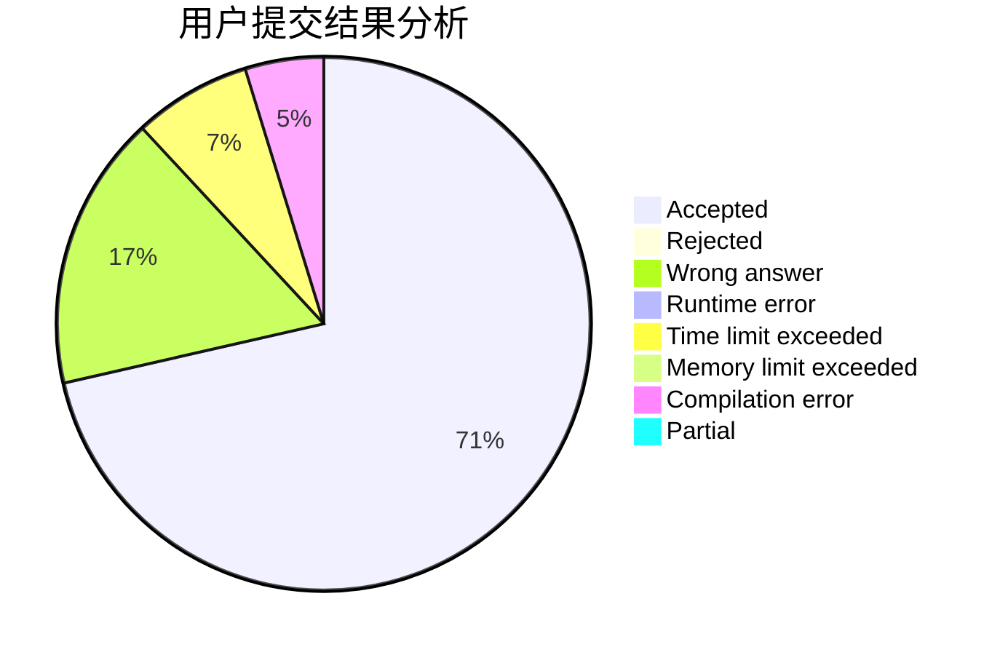
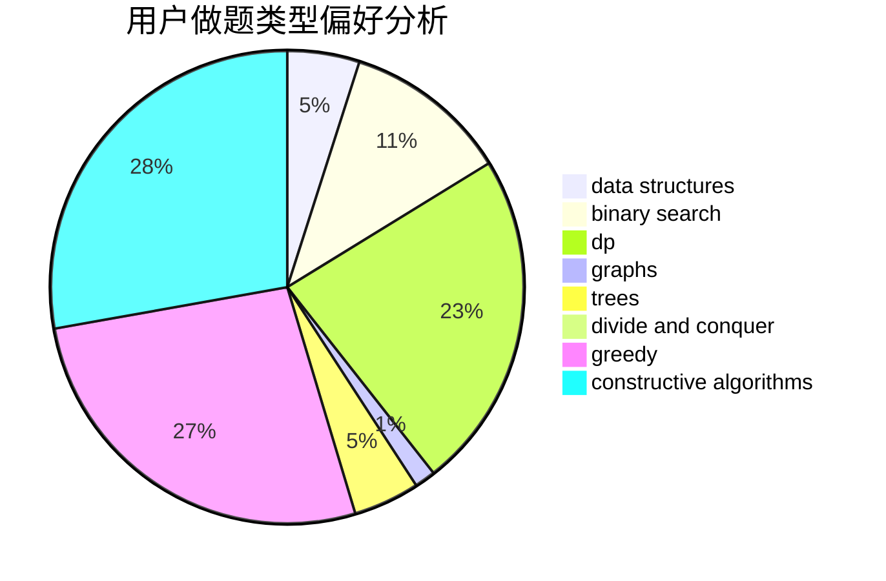

# jiawenzhuo

<!-- tabs:start -->

#### **用户提交结果分析**

#### **用户做题类型偏好分析**

#### **用户错题知识点分析**

<!-- tabs:end -->
# 推荐题目
[1299C](https://codeforces.com/contest/1299/problem/C)		data structures,
                        geometry,
                        greedy		  
[1228E](https://codeforces.com/contest/1228/problem/E)		combinatorics,
                        dp,
                        math		  
[883C](https://codeforces.com/contest/883/problem/C)		binary search,
                        implementation		  
[540B](https://codeforces.com/contest/540/problem/B)		greedy,
                        implementation		  
[1268E](https://codeforces.com/contest/1268/problem/E)		dp		  
[1141B](https://codeforces.com/contest/1141/problem/B)		implementation		  
[11732](https://codeforces.com/contest/1173/problem/2)		dsu,graphs,sortings,trees		  
[251A](https://codeforces.com/contest/251/problem/A)		binary search,
                        combinatorics,
                        two pointers		  
[934B](https://codeforces.com/contest/934/problem/B)		constructive algorithms,
                        implementation		  
[998E](https://codeforces.com/contest/998/problem/E)		dsu,graphs,sortings,trees		  
