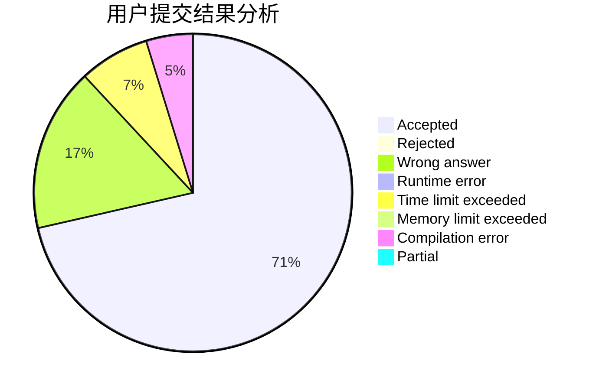
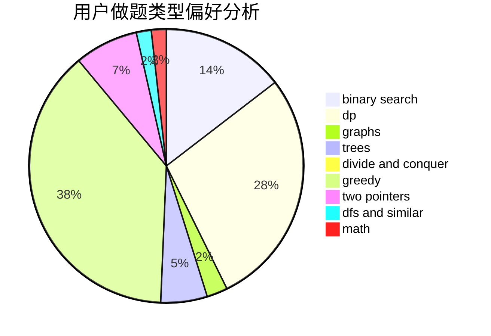

# jiawenzhuo

<!-- tabs:start -->

#### **用户提交结果分析**

#### **用户做题类型偏好分析**

<!-- tabs:end -->
# 推荐题目
[1299C](https://codeforces.com/contest/1299/problem/C)
[1228E](https://codeforces.com/contest/1228/problem/E)
[883C](https://codeforces.com/contest/883/problem/C)
[540B](https://codeforces.com/contest/540/problem/B)
[1268E](https://codeforces.com/contest/1268/problem/E)
[1141B](https://codeforces.com/contest/1141/problem/B)
[11732](https://codeforces.com/contest/1173/problem/2)
[251A](https://codeforces.com/contest/251/problem/A)
[934B](https://codeforces.com/contest/934/problem/B)
[998E](https://codeforces.com/contest/998/problem/E)
