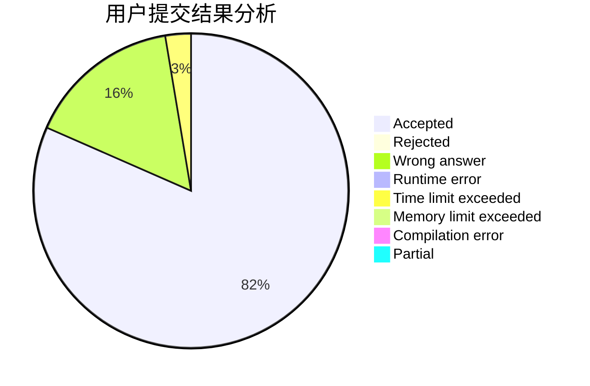
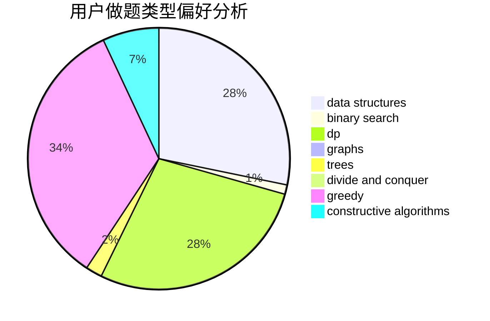

# jiazp

<!-- tabs:start -->

#### **用户提交结果分析**

#### **用户做题类型偏好分析**

#### **用户错题知识点分析**

<!-- tabs:end -->
# 推荐题目
[1480A](https://codeforces.com/contest/1480/problem/A)		games,
                        greedy,
                        strings		  
[1223E](https://codeforces.com/contest/1223/problem/E)		dp,
                        sortings,
                        trees		  
[383E](https://codeforces.com/contest/383/problem/E)		combinatorics,
                        divide and conquer,
                        dp		  
[1102E](https://codeforces.com/contest/1102/problem/E)		combinatorics,
                        sortings		  
[803B](https://codeforces.com/contest/803/problem/B)		constructive algorithms		  
[1325C](https://codeforces.com/contest/1325/problem/C)		constructive algorithms,
                        dfs and similar,
                        greedy,
                        trees		  
[294C](https://codeforces.com/contest/294/problem/C)		combinatorics,
                        number theory		  
[16B](https://codeforces.com/contest/16/problem/B)		greedy,
                        implementation,
                        sortings		  
[868A](https://codeforces.com/contest/868/problem/A)		brute force,
                        implementation,
                        strings		  
[464E](https://codeforces.com/contest/464/problem/E)		data structures,
                        graphs,
                        shortest paths		  
