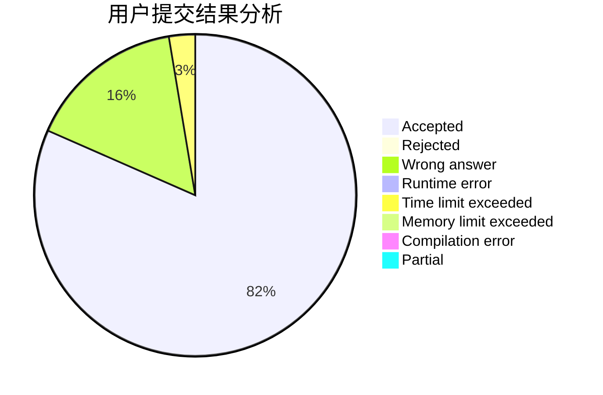
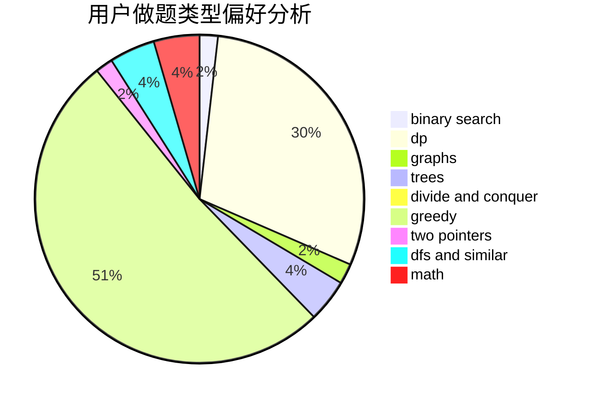

# jiazp

<!-- tabs:start -->

#### **用户提交结果分析**

#### **用户做题类型偏好分析**

<!-- tabs:end -->
# 推荐题目
[1480A](https://codeforces.com/contest/1480/problem/A)
[1223E](https://codeforces.com/contest/1223/problem/E)
[383E](https://codeforces.com/contest/383/problem/E)
[1102E](https://codeforces.com/contest/1102/problem/E)
[803B](https://codeforces.com/contest/803/problem/B)
[1325C](https://codeforces.com/contest/1325/problem/C)
[294C](https://codeforces.com/contest/294/problem/C)
[16B](https://codeforces.com/contest/16/problem/B)
[868A](https://codeforces.com/contest/868/problem/A)
[464E](https://codeforces.com/contest/464/problem/E)
