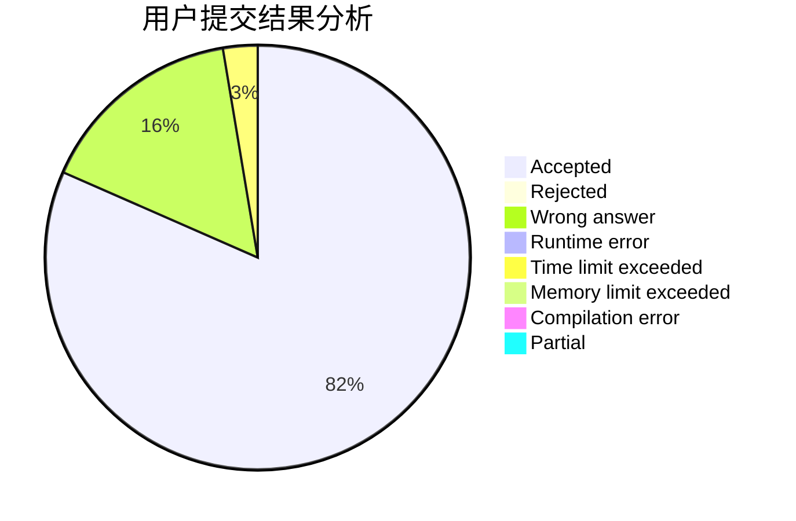
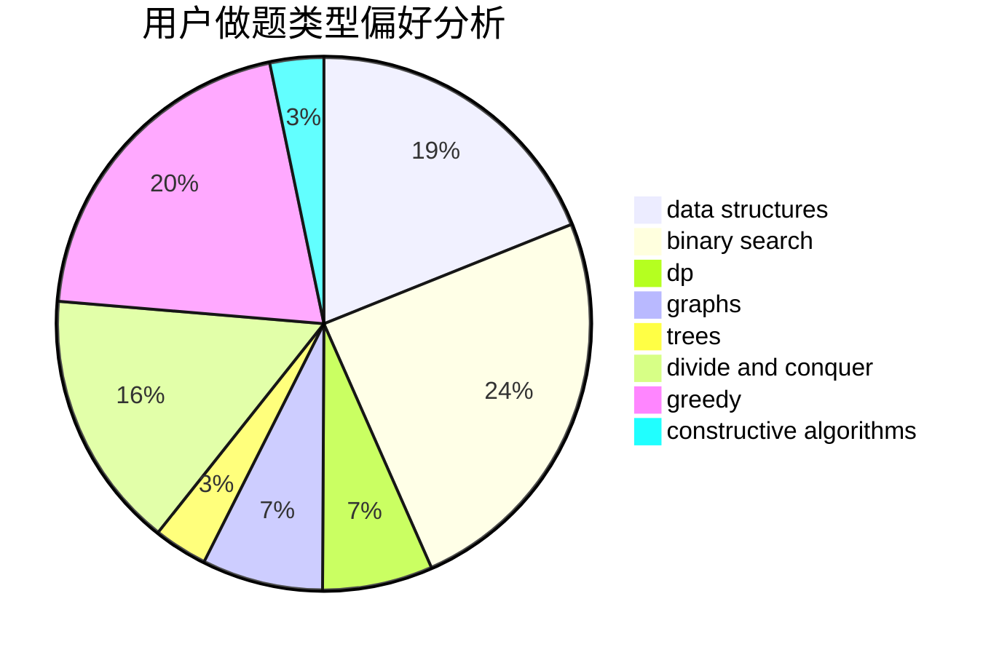

# jiazp

<!-- tabs:start -->

#### **用户提交结果分析**

#### **用户做题类型偏好分析**

#### **用户错题知识点分析**

<!-- tabs:end -->
# 推荐题目
[1472A](https://codeforces.com/contest/1472/problem/A)		greedy,
                        math		  
[1217A](https://codeforces.com/contest/1217/problem/A)		binary search,
                        math		  
[358D](https://codeforces.com/contest/358/problem/D)		dp,
                        greedy		  
[1102B](https://codeforces.com/contest/1102/problem/B)		greedy,
                        sortings		  
[787A](https://codeforces.com/contest/787/problem/A)		brute force,
                        math,
                        number theory		  
[1315D](https://codeforces.com/contest/1315/problem/D)		dsu,graphs,sortings,trees		  
[279D](https://codeforces.com/contest/279/problem/D)		bitmasks,
                        dp		  
[1511E](https://codeforces.com/contest/1511/problem/E)		combinatorics,
                        dp,
                        greedy,
                        math		  
[848D](https://codeforces.com/contest/848/problem/D)		combinatorics,
                        dp,
                        flows,
                        graphs		  
[445A](https://codeforces.com/contest/445/problem/A)		dfs and similar,
                        implementation		  
