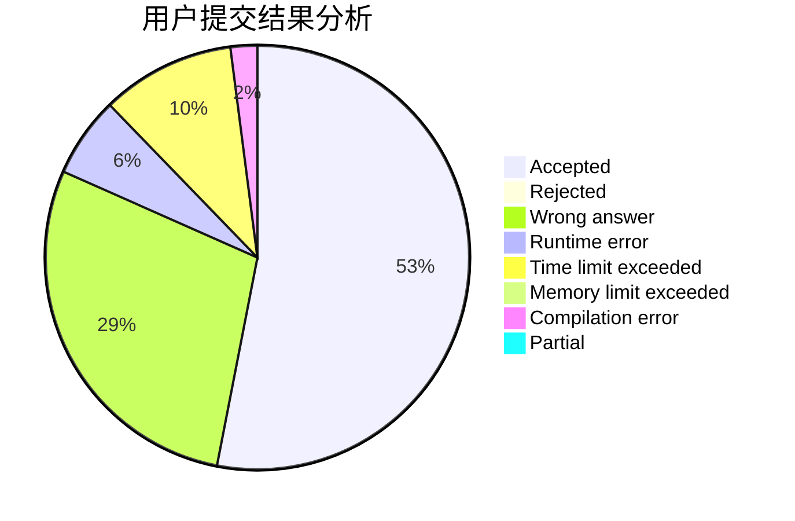
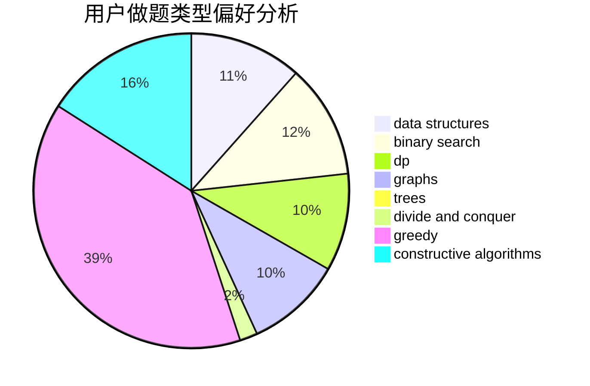
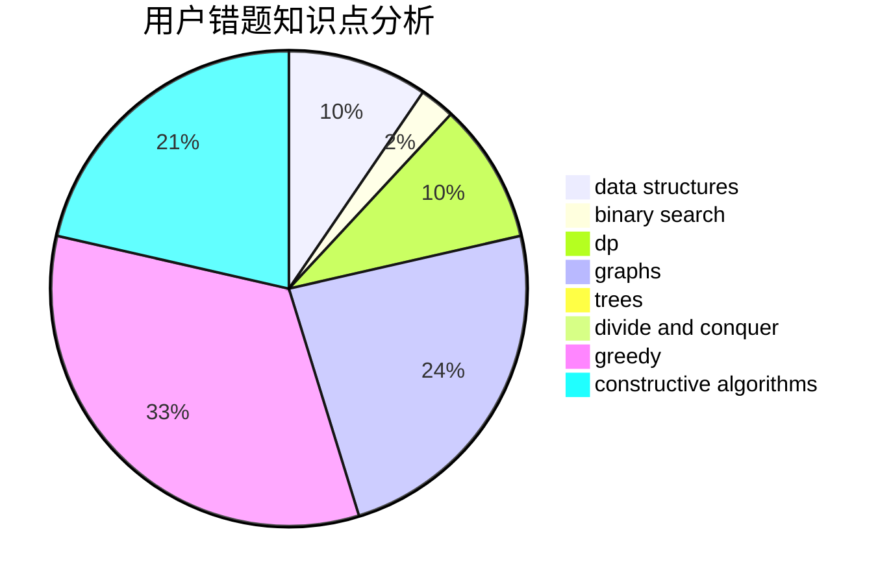

# jiedai
<!-- tabs:start -->
#### **用户提交结果分析**

#### **用户做题类型偏好分析**

#### **用户错题知识点分析**

<!-- tabs:end -->
# 推荐题目
[Navigation System](https://codeforces.com/contest/1321/problem/D)		dfs and similar,
                        graphs,
                        shortest paths		  
[Towers](http://codeforces.com/problemset/problem/229/D)		dp,
                        greedy,
                        two pointers		  
[Expansion coefficient of the array](http://codeforces.com/problemset/problem/1159/B)		implementation,
                        math		  
[Couple Cover](http://codeforces.com/problemset/problem/691/F)		brute force,
                        dp,
                        number theory		  
[Double Profiles](http://codeforces.com/problemset/problem/154/C)		graphs,
                        hashing,
                        sortings		  
[Little Dima and Equation](http://codeforces.com/problemset/problem/460/B)		brute force,
                        implementation,
                        math,
                        number theory		  
[Nezzar and Nice Beatmap](https://codeforces.com/contest/1478/problem/F)		constructive algorithms,
                        geometry,
                        greedy,
                        math,
                        sortings		  
[Present for Vitalik the Philatelist](http://codeforces.com/problemset/problem/585/E)		combinatorics,
                        math,
                        number theory		  
[Good Array](http://codeforces.com/problemset/problem/1077/C)		nan		  
[Pyramid of Glasses](http://codeforces.com/problemset/problem/676/B)		implementation,
                        math,
                        math		  
<!-- tabs:start -->
#### **data structures**
[Navigation System](http://codeforces.com/problemset/problem/842/D)		binary search,
                        data structures		  
[Towers](http://codeforces.com/problemset/problem/845/D)		data structures,
                        dp,
                        greedy		  
[Expansion coefficient of the array](http://codeforces.com/problemset/problem/675/D)		data structures,
                        trees		  
[Couple Cover](http://codeforces.com/problemset/problem/1260/F)		data structures,
                        trees		  
[Double Profiles](http://codeforces.com/problemset/problem/587/F)		data structures,
                        strings		  
[Little Dima and Equation](http://codeforces.com/problemset/problem/815/D)		binary search,
                        combinatorics,
                        data structures,
                        geometry		  
[Nezzar and Nice Beatmap](http://codeforces.com/problemset/problem/1492/C)		binary search,
                        data structures,
                        dp,
                        greedy,
                        two pointers		  
[Present for Vitalik the Philatelist](http://codeforces.com/problemset/problem/1490/G)		binary search,
                        data structures,
                        math		  
[Good Array](http://codeforces.com/problemset/problem/1479/D)		binary search,
                        bitmasks,
                        brute force,
                        data structures,
                        probabilities,
                        trees		  
[Pyramid of Glasses](http://codeforces.com/problemset/problem/1497/A)		brute force,
                        data structures,
                        greedy,
                        sortings		  
#### **binary search**
[Navigation System](http://codeforces.com/problemset/problem/842/D)		binary search,
                        data structures		  
[Towers](http://codeforces.com/problemset/problem/83/B)		binary search,
                        math,
                        sortings		  
[Expansion coefficient of the array](http://codeforces.com/problemset/problem/492/D)		binary search,
                        implementation,
                        math,
                        sortings		  
[Couple Cover](http://codeforces.com/problemset/problem/815/D)		binary search,
                        combinatorics,
                        data structures,
                        geometry		  
[Double Profiles](http://codeforces.com/problemset/problem/1492/C)		binary search,
                        data structures,
                        dp,
                        greedy,
                        two pointers		  
[Little Dima and Equation](http://codeforces.com/problemset/problem/1463/D)		binary search,
                        constructive algorithms,
                        greedy,
                        two pointers		  
[Nezzar and Nice Beatmap](http://codeforces.com/problemset/problem/1490/G)		binary search,
                        data structures,
                        math		  
[Present for Vitalik the Philatelist](http://codeforces.com/problemset/problem/1479/D)		binary search,
                        bitmasks,
                        brute force,
                        data structures,
                        probabilities,
                        trees		  
[Good Array](http://codeforces.com/problemset/problem/1436/E)		binary search,
                        data structures,
                        two pointers		  
[Pyramid of Glasses](http://codeforces.com/problemset/problem/1461/D)		binary search,
                        brute force,
                        data structures,
                        divide and conquer,
                        implementation,
                        sortings		  
#### **dp**
[Navigation System](http://codeforces.com/problemset/problem/229/D)		dp,
                        greedy,
                        two pointers		  
[Towers](http://codeforces.com/problemset/problem/691/F)		brute force,
                        dp,
                        number theory		  
[Expansion coefficient of the array](http://codeforces.com/problemset/problem/1065/D)		dfs and similar,
                        dp,
                        shortest paths		  
[Couple Cover](http://codeforces.com/problemset/problem/550/A)		brute force,
                        dp,
                        greedy,
                        implementation,
                        strings		  
[Double Profiles](http://codeforces.com/problemset/problem/845/D)		data structures,
                        dp,
                        greedy		  
[Little Dima and Equation](http://codeforces.com/problemset/problem/798/B)		brute force,
                        dp,
                        strings		  
[Nezzar and Nice Beatmap](http://codeforces.com/problemset/problem/1105/E)		bitmasks,
                        brute force,
                        dp,
                        meet-in-the-middle		  
[Present for Vitalik the Philatelist](http://codeforces.com/problemset/problem/1322/F)		dp,
                        trees		  
[Good Array](http://codeforces.com/problemset/problem/1286/A)		dp,
                        greedy,
                        sortings		  
[Pyramid of Glasses](http://codeforces.com/problemset/problem/1453/F)		dp		  
#### **graph**
[Navigation System](https://codeforces.com/contest/1321/problem/D)		dfs and similar,
                        graphs,
                        shortest paths		  
[Towers](http://codeforces.com/problemset/problem/154/C)		graphs,
                        hashing,
                        sortings		  
[Expansion coefficient of the array](http://codeforces.com/problemset/problem/1487/C)		brute force,
                        constructive algorithms,
                        dfs and similar,
                        graphs,
                        greedy,
                        implementation,
                        math		  
[Couple Cover](http://codeforces.com/problemset/problem/1437/C)		dp,
                        flows,
                        graph matchings,
                        greedy,
                        math,
                        sortings		  
[Double Profiles](http://codeforces.com/problemset/problem/1470/D)		constructive algorithms,
                        dfs and similar,
                        graph matchings,
                        graphs,
                        greedy		  
[Little Dima and Equation](http://codeforces.com/problemset/problem/1476/C)		dp,
                        graphs,
                        greedy		  
[Nezzar and Nice Beatmap](http://codeforces.com/problemset/problem/1304/D)		constructive algorithms,
                        graphs,
                        greedy,
                        two pointers		  
[Present for Vitalik the Philatelist](http://codeforces.com/problemset/problem/1475/C)		combinatorics,
                        graphs,
                        math		  
[Good Array](http://codeforces.com/problemset/problem/553/E)		dp,
                        fft,
                        graphs,
                        math,
                        probabilities		  
[Pyramid of Glasses](http://codeforces.com/problemset/problem/1495/C)		constructive algorithms,
                        graphs		  
#### **trees**
[Navigation System](http://codeforces.com/problemset/problem/675/D)		data structures,
                        trees		  
[Towers](http://codeforces.com/problemset/problem/1260/F)		data structures,
                        trees		  
[Expansion coefficient of the array](http://codeforces.com/problemset/problem/1322/F)		dp,
                        trees		  
[Couple Cover](http://codeforces.com/problemset/problem/1479/D)		binary search,
                        bitmasks,
                        brute force,
                        data structures,
                        probabilities,
                        trees		  
[Double Profiles](http://codeforces.com/problemset/problem/1511/C)		brute force,
                        data structures,
                        implementation,
                        trees		  
[Little Dima and Equation](http://codeforces.com/problemset/problem/1499/F)		combinatorics,
                        dfs and similar,
                        dp,
                        trees		  
[Nezzar and Nice Beatmap](http://codeforces.com/problemset/problem/1491/E)		brute force,
                        dfs and similar,
                        divide and conquer,
                        number theory,
                        trees		  
[Present for Vitalik the Philatelist](http://codeforces.com/problemset/problem/1466/D)		data structures,
                        greedy,
                        sortings,
                        trees		  
[Good Array](http://codeforces.com/problemset/problem/1495/D)		combinatorics,
                        dfs and similar,
                        graphs,
                        math,
                        shortest paths,
                        trees		  
[Pyramid of Glasses](http://codeforces.com/problemset/problem/1303/G)		data structures,
                        divide and conquer,
                        geometry,
                        trees		  
#### **divide and conquer**
[Navigation System](http://codeforces.com/problemset/problem/1461/D)		binary search,
                        brute force,
                        data structures,
                        divide and conquer,
                        implementation,
                        sortings		  
[Towers](http://codeforces.com/problemset/problem/1466/G)		combinatorics,
                        divide and conquer,
                        hashing,
                        math,
                        string suffix structures,
                        strings		  
[Expansion coefficient of the array](http://codeforces.com/problemset/problem/1490/D)		dfs and similar,
                        divide and conquer,
                        implementation		  
[Couple Cover](https://codeforces.com/contest/1483/problem/C)		data structures,
                        divide and conquer,
                        dp		  
[Double Profiles](http://codeforces.com/problemset/problem/1491/E)		brute force,
                        dfs and similar,
                        divide and conquer,
                        number theory,
                        trees		  
[Little Dima and Equation](http://codeforces.com/problemset/problem/1303/G)		data structures,
                        divide and conquer,
                        geometry,
                        trees		  
[Nezzar and Nice Beatmap](http://codeforces.com/problemset/problem/1494/D)		constructive algorithms,
                        data structures,
                        dfs and similar,
                        divide and conquer,
                        dsu,
                        greedy,
                        sortings,
                        trees		  
[Present for Vitalik the Philatelist](http://codeforces.com/problemset/problem/1482/E)		data structures,
                        divide and conquer,
                        dp		  
[Good Array](http://codeforces.com/problemset/problem/566/C)		dfs and similar,
                        divide and conquer,
                        trees		  
[Pyramid of Glasses](http://codeforces.com/problemset/problem/1428/F)		binary search,
                        data structures,
                        divide and conquer,
                        dp,
                        two pointers		  
#### **greedy**
[Navigation System](http://codeforces.com/problemset/problem/229/D)		dp,
                        greedy,
                        two pointers		  
[Towers](https://codeforces.com/contest/1478/problem/F)		constructive algorithms,
                        geometry,
                        greedy,
                        math,
                        sortings		  
[Expansion coefficient of the array](http://codeforces.com/problemset/problem/787/B)		greedy,
                        implementation,
                        math		  
[Couple Cover](http://codeforces.com/problemset/problem/1108/E1)		brute force,
                        greedy,
                        implementation		  
[Double Profiles](http://codeforces.com/problemset/problem/550/A)		brute force,
                        dp,
                        greedy,
                        implementation,
                        strings		  
[Little Dima and Equation](http://codeforces.com/problemset/problem/570/B)		constructive algorithms,
                        games,
                        greedy,
                        implementation,
                        math		  
[Nezzar and Nice Beatmap](http://codeforces.com/problemset/problem/845/D)		data structures,
                        dp,
                        greedy		  
[Present for Vitalik the Philatelist](http://codeforces.com/problemset/problem/805/A)		greedy,
                        math		  
[Good Array](http://codeforces.com/problemset/problem/746/E)		greedy,
                        implementation,
                        math		  
[Pyramid of Glasses](http://codeforces.com/problemset/problem/1077/B)		greedy		  
#### **constructive algorithms**
[Navigation System](https://codeforces.com/contest/1478/problem/F)		constructive algorithms,
                        geometry,
                        greedy,
                        math,
                        sortings		  
[Towers](http://codeforces.com/problemset/problem/570/B)		constructive algorithms,
                        games,
                        greedy,
                        implementation,
                        math		  
[Expansion coefficient of the array](http://codeforces.com/problemset/problem/934/B)		constructive algorithms,
                        implementation		  
[Couple Cover](http://codeforces.com/problemset/problem/1451/E1)		bitmasks,
                        constructive algorithms,
                        interactive,
                        math		  
[Double Profiles](http://codeforces.com/problemset/problem/1375/E)		constructive algorithms,
                        greedy,
                        sortings		  
[Little Dima and Equation](http://codeforces.com/problemset/problem/1237/H)		constructive algorithms		  
[Nezzar and Nice Beatmap](http://codeforces.com/problemset/problem/1493/A)		constructive algorithms,
                        greedy		  
[Present for Vitalik the Philatelist](http://codeforces.com/problemset/problem/1463/D)		binary search,
                        constructive algorithms,
                        greedy,
                        two pointers		  
[Good Array](https://codeforces.com/contest/1456/problem/B)		bitmasks,
                        brute force,
                        constructive algorithms		  
[Pyramid of Glasses](http://codeforces.com/problemset/problem/1492/D)		bitmasks,
                        constructive algorithms,
                        greedy,
                        math		  
#### **sortings**
[Navigation System](http://codeforces.com/problemset/problem/154/C)		graphs,
                        hashing,
                        sortings		  
[Towers](https://codeforces.com/contest/1478/problem/F)		constructive algorithms,
                        geometry,
                        greedy,
                        math,
                        sortings		  
[Expansion coefficient of the array](http://codeforces.com/problemset/problem/83/B)		binary search,
                        math,
                        sortings		  
[Couple Cover](http://codeforces.com/problemset/problem/492/D)		binary search,
                        implementation,
                        math,
                        sortings		  
[Double Profiles](http://codeforces.com/problemset/problem/1375/E)		constructive algorithms,
                        greedy,
                        sortings		  
[Little Dima and Equation](http://codeforces.com/problemset/problem/1286/A)		dp,
                        greedy,
                        sortings		  
[Nezzar and Nice Beatmap](http://codeforces.com/problemset/problem/1398/B)		games,
                        greedy,
                        sortings		  
[Present for Vitalik the Philatelist](http://codeforces.com/problemset/problem/1165/E)		greedy,
                        math,
                        sortings		  
[Good Array](https://codeforces.com/contest/1496/problem/C)		geometry,
                        greedy,
                        math,
                        sortings		  
[Pyramid of Glasses](http://codeforces.com/problemset/problem/1495/A)		geometry,
                        greedy,
                        math,
                        sortings		  
<!-- tabs:end -->
