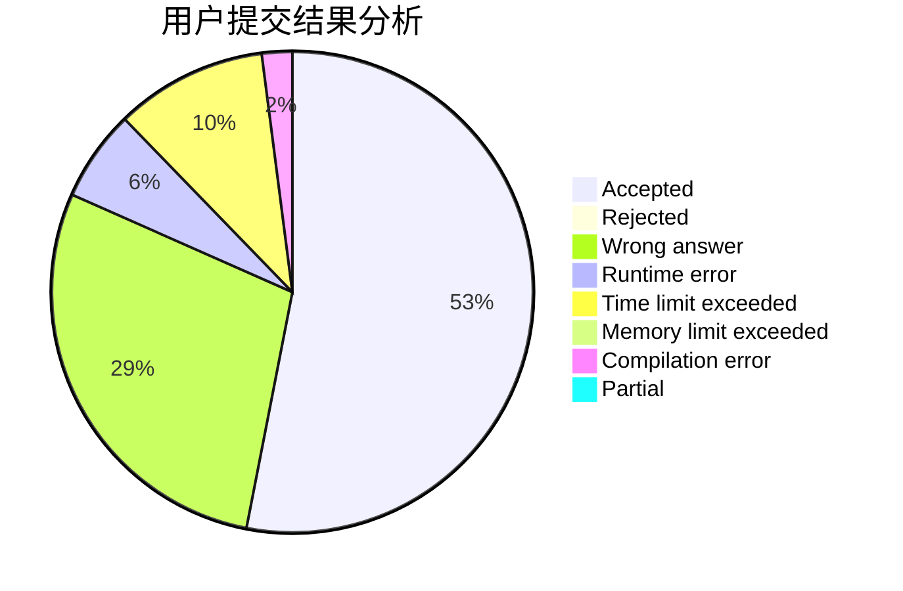
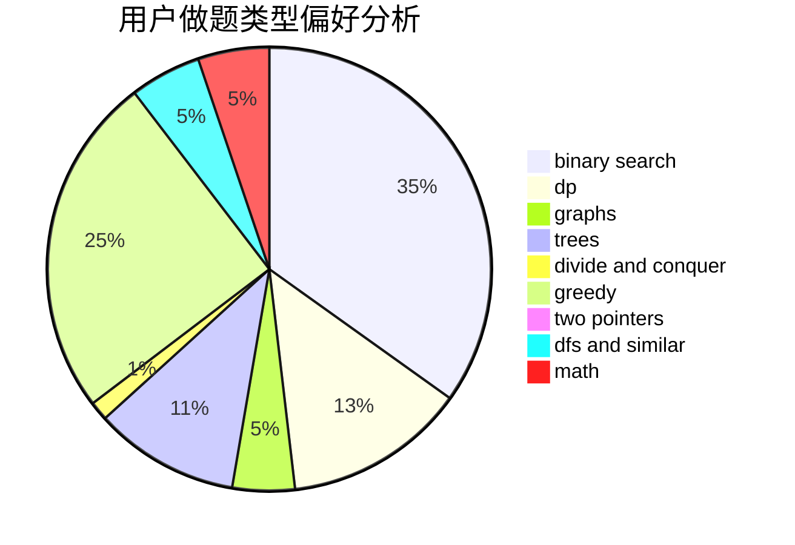

# jiedai

<!-- tabs:start -->

#### **用户提交结果分析**

#### **用户做题类型偏好分析**

<!-- tabs:end -->
# 推荐题目
[1487D](https://codeforces.com/contest/1487/problem/D)
[1463C](https://codeforces.com/contest/1463/problem/C)
[1266F](https://codeforces.com/contest/1266/problem/F)
[1168A](https://codeforces.com/contest/1168/problem/A)
[249E](https://codeforces.com/contest/249/problem/E)
[479E](https://codeforces.com/contest/479/problem/E)
[812B](https://codeforces.com/contest/812/problem/B)
[1384D](https://codeforces.com/contest/1384/problem/D)
[766A](https://codeforces.com/contest/766/problem/A)
[700B](https://codeforces.com/contest/700/problem/B)
