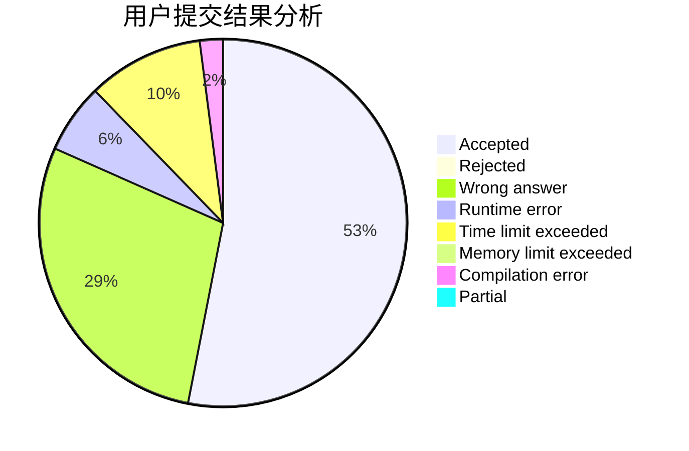
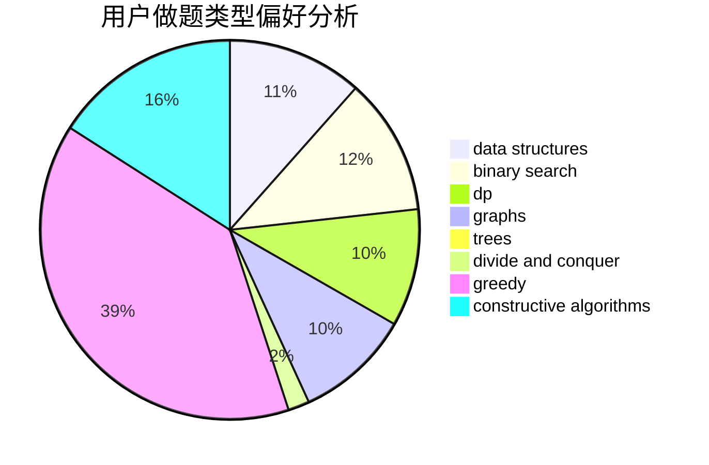
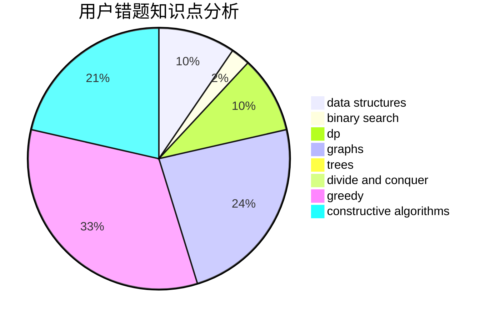

# jiedai

<!-- tabs:start -->

#### **用户提交结果分析**

#### **用户做题类型偏好分析**

#### **用户错题知识点分析**

<!-- tabs:end -->
# 推荐题目
[1478F](https://codeforces.com/contest/1478/problem/F)		dsu,graphs,sortings,trees		  
[1453F](https://codeforces.com/contest/1453/problem/F)		dp		  
[1260F](https://codeforces.com/contest/1260/problem/F)		data structures,
                        trees		  
[1165E](https://codeforces.com/contest/1165/problem/E)		greedy,
                        math,
                        sortings		  
[229D](https://codeforces.com/contest/229/problem/D)		dp,
                        greedy,
                        two pointers		  
[460B](https://codeforces.com/contest/460/problem/B)		brute force,
                        implementation,
                        math,
                        number theory		  
[798B](https://codeforces.com/contest/798/problem/B)		brute force,
                        dp,
                        strings		  
[1375E](https://codeforces.com/contest/1375/problem/E)		constructive algorithms,
                        greedy,
                        sortings		  
[746E](https://codeforces.com/contest/746/problem/E)		greedy,
                        implementation,
                        math		  
[676B](https://codeforces.com/contest/676/problem/B)		implementation,
                        math,
                        math		  
