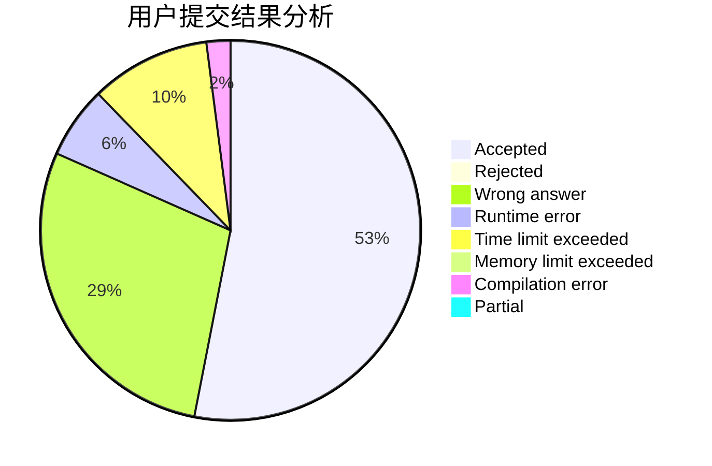
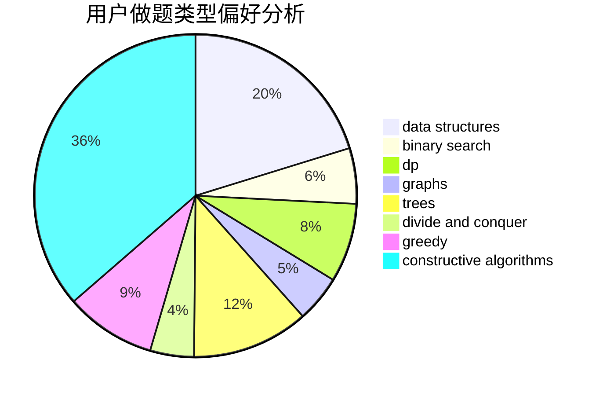
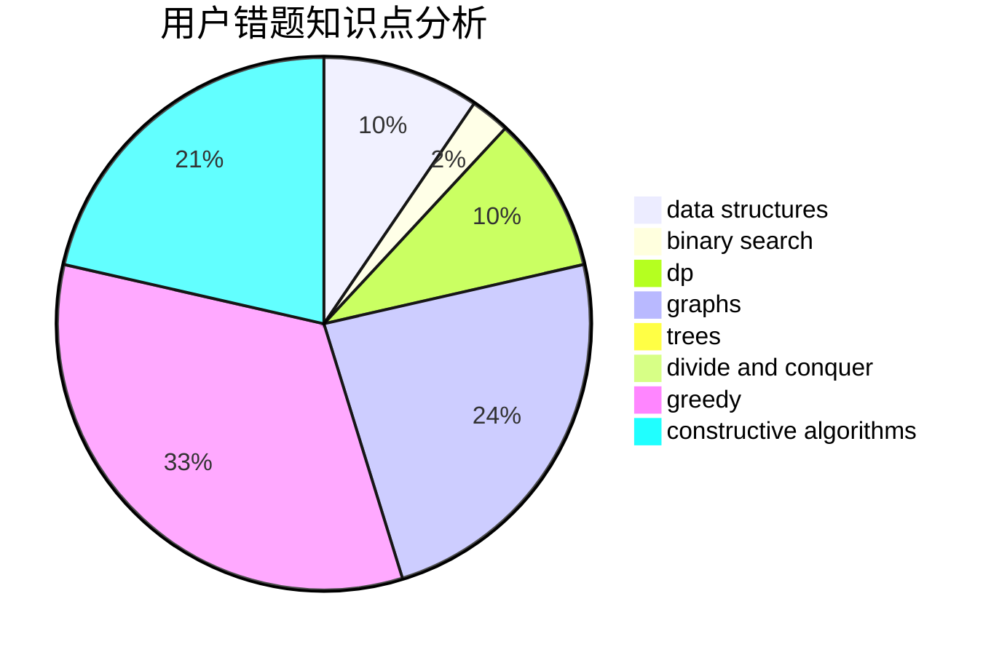

# jiedai

<!-- tabs:start -->

#### **用户提交结果分析**

#### **用户做题类型偏好分析**

#### **用户错题知识点分析**

<!-- tabs:end -->
# 推荐题目
[1487D](https://codeforces.com/contest/1487/problem/D)		binary search,
                        brute force,
                        math,
                        number theory		  
[1463C](https://codeforces.com/contest/1463/problem/C)		implementation		  
[1266F](https://codeforces.com/contest/1266/problem/F)		dfs and similar,
                        graphs		  
[1168A](https://codeforces.com/contest/1168/problem/A)		binary search,
                        greedy		  
[249E](https://codeforces.com/contest/249/problem/E)		math		  
[479E](https://codeforces.com/contest/479/problem/E)		combinatorics,
                        dp		  
[812B](https://codeforces.com/contest/812/problem/B)		bitmasks,
                        brute force,
                        dp		  
[1384D](https://codeforces.com/contest/1384/problem/D)		dsu,graphs,sortings,trees		  
[766A](https://codeforces.com/contest/766/problem/A)		constructive algorithms,
                        strings		  
[700B](https://codeforces.com/contest/700/problem/B)		dfs and similar,
                        dp,
                        graphs,
                        trees		  
