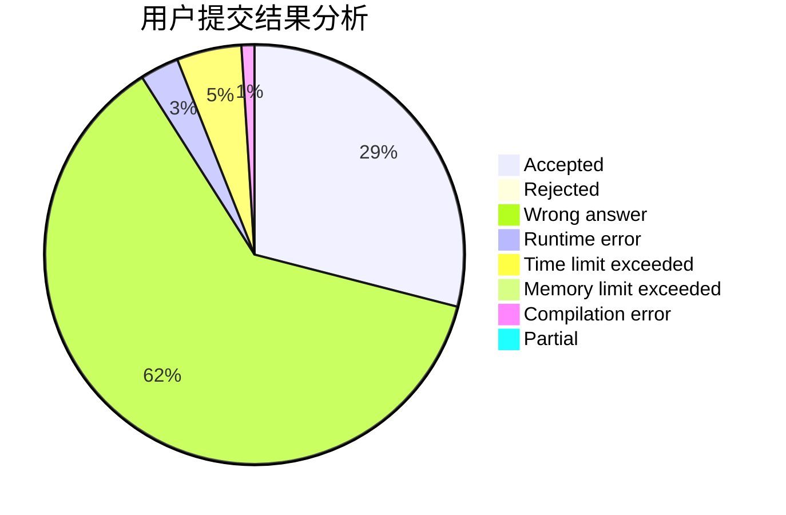
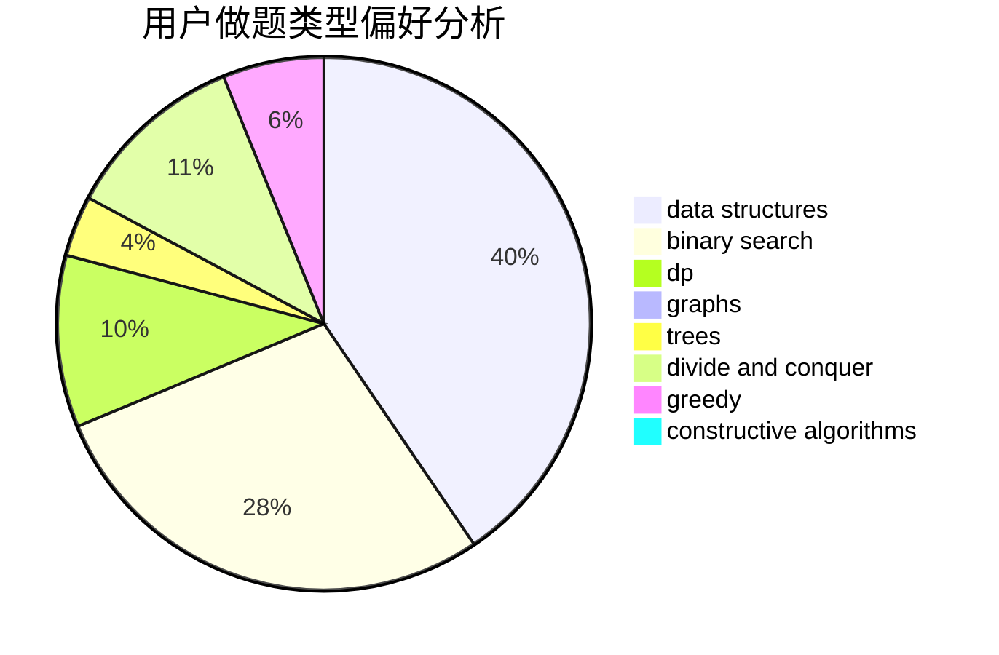

# jinfeixibi

<!-- tabs:start -->

#### **用户提交结果分析**

#### **用户做题类型偏好分析**

#### **用户错题知识点分析**

<!-- tabs:end -->
# 推荐题目
[76C](https://codeforces.com/contest/76/problem/C)		bitmasks,
                        dp,
                        math		  
[471A](https://codeforces.com/contest/471/problem/A)		implementation		  
[750F](https://codeforces.com/contest/750/problem/F)		constructive algorithms,
                        implementation,
                        interactive,
                        trees		  
[51A](https://codeforces.com/contest/51/problem/A)		implementation		  
[1227A](https://codeforces.com/contest/1227/problem/A)		math		  
[1070F](https://codeforces.com/contest/1070/problem/F)		greedy		  
[1370C](https://codeforces.com/contest/1370/problem/C)		games,
                        math,
                        number theory		  
[215E](https://codeforces.com/contest/215/problem/E)		combinatorics,
                        dp,
                        number theory		  
[1264D1](https://codeforces.com/contest/1264D/problem/1)		combinatorics,
                        dp,
                        probabilities		  
[339C](https://codeforces.com/contest/339/problem/C)		constructive algorithms,
                        dfs and similar,
                        dp,
                        graphs,
                        greedy,
                        shortest paths		  
