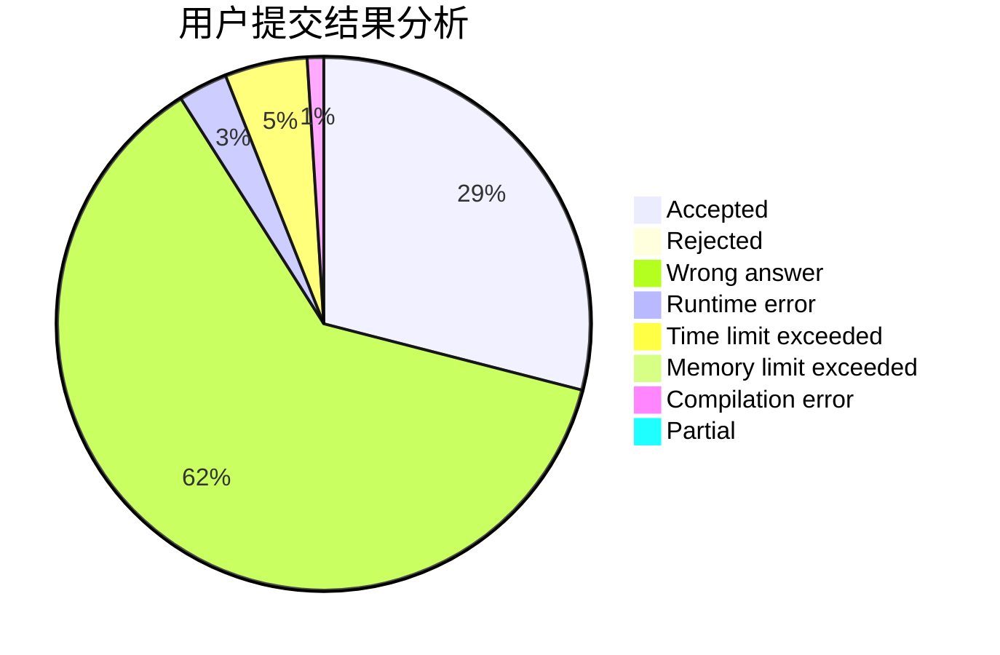
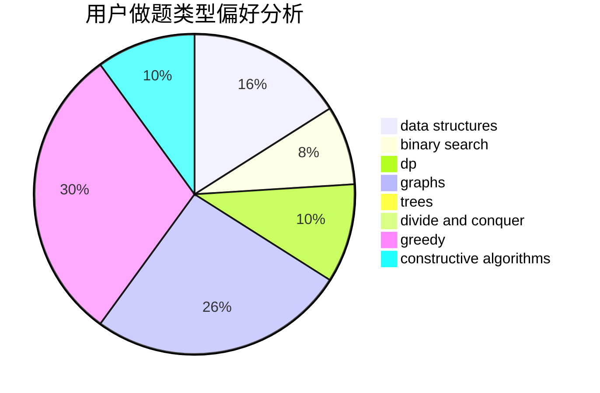

# jinfeixibi

<!-- tabs:start -->

#### **用户提交结果分析**

#### **用户做题类型偏好分析**

#### **用户错题知识点分析**

<!-- tabs:end -->
# 推荐题目
[789D](https://codeforces.com/contest/789/problem/D)		dsu,graphs,sortings,trees		  
[489F](https://codeforces.com/contest/489/problem/F)		combinatorics,
                        dp		  
[770C](https://codeforces.com/contest/770/problem/C)		*special problem,
                        dfs and similar,
                        graphs,
                        implementation		  
[545B](https://codeforces.com/contest/545/problem/B)		greedy		  
[1234E](https://codeforces.com/contest/1234/problem/E)		math		  
[1070I](https://codeforces.com/contest/1070/problem/I)		flows,
                        graph matchings,
                        graphs		  
[13792](https://codeforces.com/contest/1379/problem/2)		dsu,graphs,sortings,trees		  
[235B](https://codeforces.com/contest/235/problem/B)		dp,
                        math,
                        probabilities		  
[1270B](https://codeforces.com/contest/1270/problem/B)		constructive algorithms,
                        greedy,
                        math		  
[366C](https://codeforces.com/contest/366/problem/C)		dp		  
