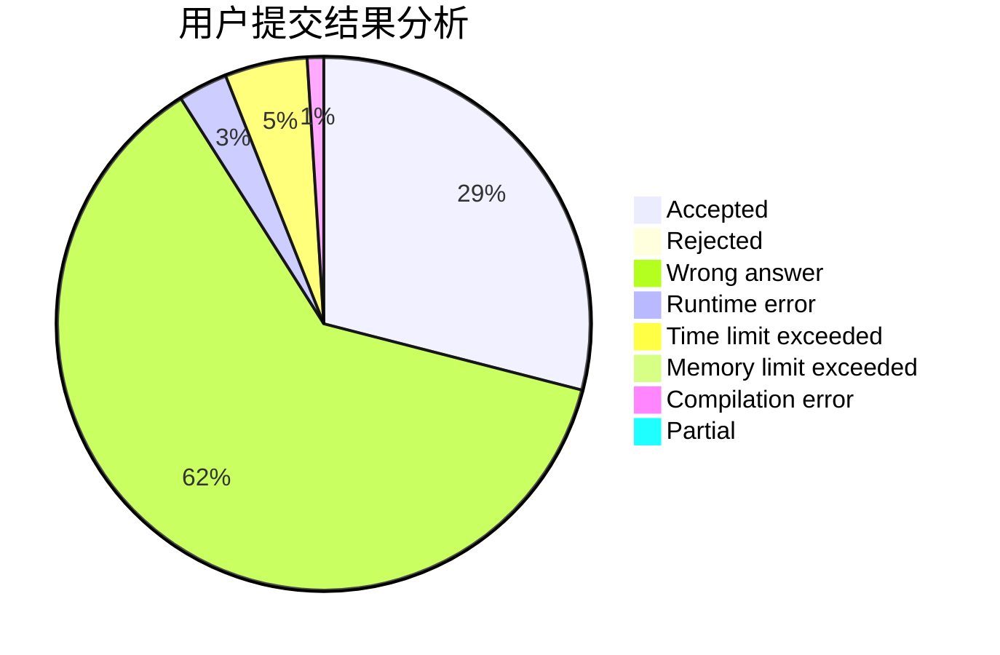
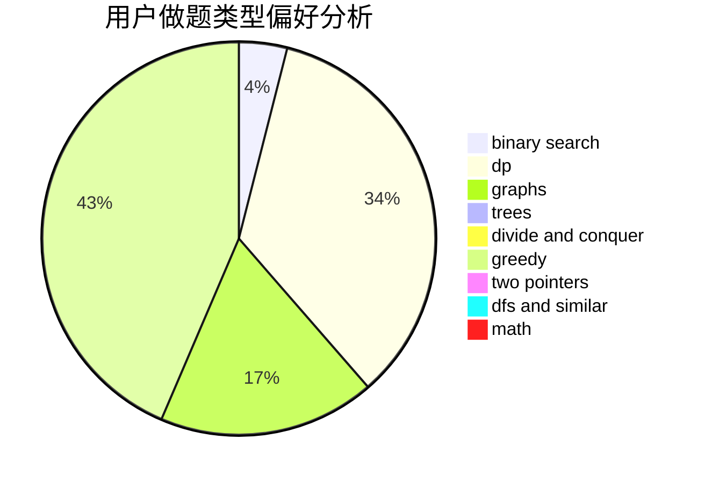

# jinfeixibi

<!-- tabs:start -->

#### **用户提交结果分析**

#### **用户做题类型偏好分析**

<!-- tabs:end -->
# 推荐题目
[789D](https://codeforces.com/contest/789/problem/D)
[489F](https://codeforces.com/contest/489/problem/F)
[770C](https://codeforces.com/contest/770/problem/C)
[545B](https://codeforces.com/contest/545/problem/B)
[1234E](https://codeforces.com/contest/1234/problem/E)
[1070I](https://codeforces.com/contest/1070/problem/I)
[13792](https://codeforces.com/contest/1379/problem/2)
[235B](https://codeforces.com/contest/235/problem/B)
[1270B](https://codeforces.com/contest/1270/problem/B)
[366C](https://codeforces.com/contest/366/problem/C)
