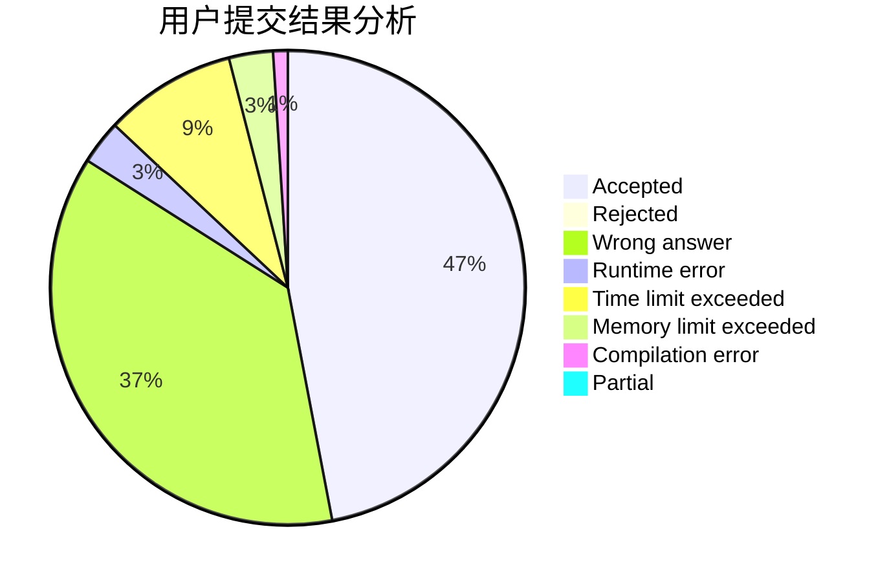
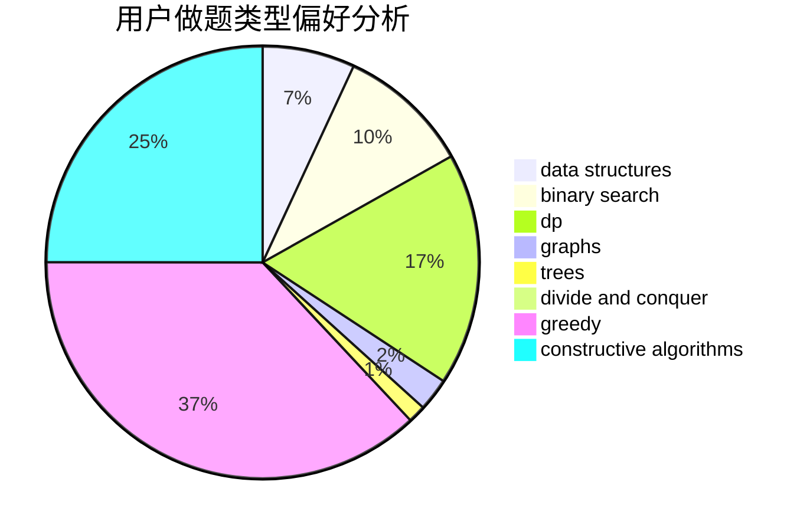
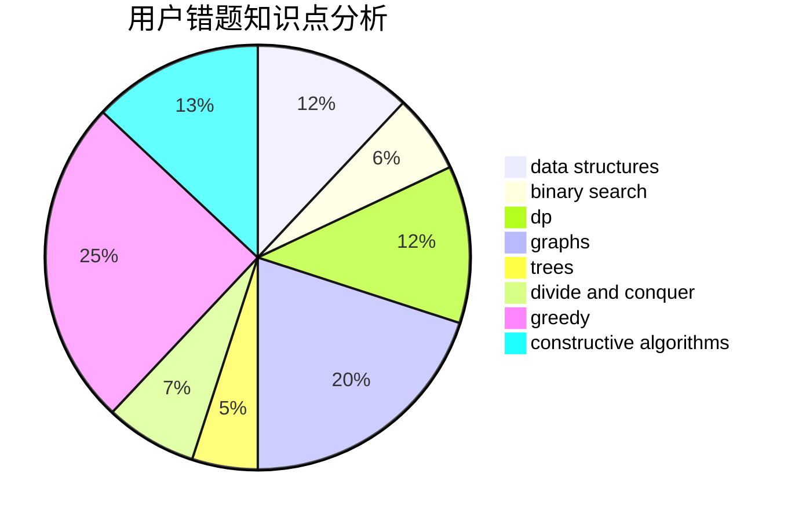

# jinhb5518

<!-- tabs:start -->

#### **用户提交结果分析**

#### **用户做题类型偏好分析**

#### **用户错题知识点分析**

<!-- tabs:end -->
# 推荐题目
[299C](https://codeforces.com/contest/299/problem/C)		dsu,graphs,sortings,trees		  
[1085G](https://codeforces.com/contest/1085/problem/G)		combinatorics,
                        data structures,
                        dp		  
[1366B](https://codeforces.com/contest/1366/problem/B)		math,
                        two pointers		  
[768C](https://codeforces.com/contest/768/problem/C)		brute force,
                        dp,
                        implementation,
                        sortings		  
[22B](https://codeforces.com/contest/22/problem/B)		brute force,
                        dp		  
[19A](https://codeforces.com/contest/19/problem/A)		implementation		  
[297A](https://codeforces.com/contest/297/problem/A)		constructive algorithms		  
[1354F](https://codeforces.com/contest/1354/problem/F)		constructive algorithms,
                        dp,
                        flows,
                        graph matchings,
                        greedy,
                        sortings		  
[1207C](https://codeforces.com/contest/1207/problem/C)		dp,
                        greedy		  
[457D](https://codeforces.com/contest/457/problem/D)		combinatorics,
                        math,
                        probabilities		  
