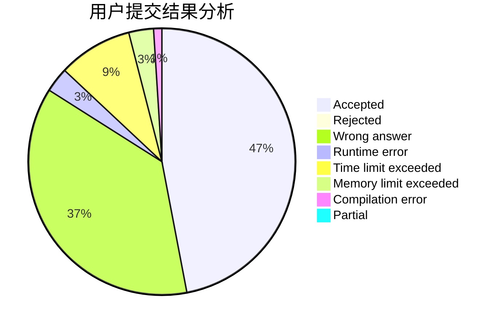
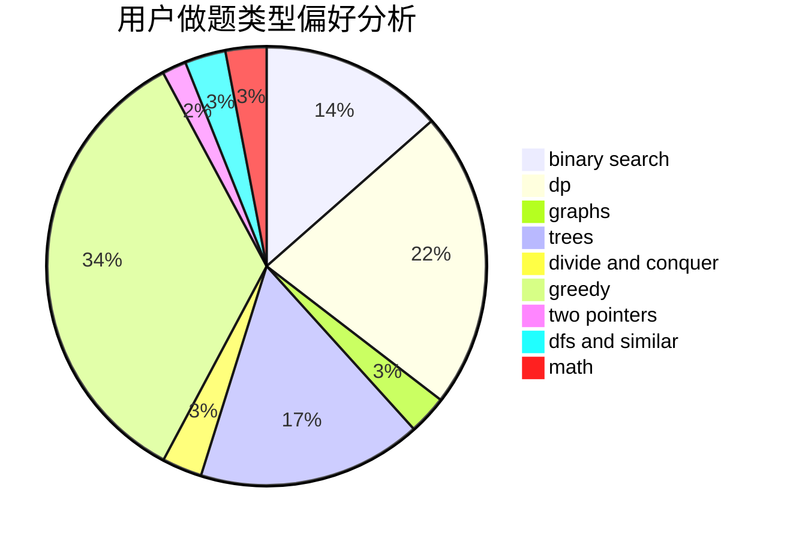

# jinhb5518

<!-- tabs:start -->

#### **用户提交结果分析**

#### **用户做题类型偏好分析**

<!-- tabs:end -->
# 推荐题目
[3162](https://codeforces.com/contest/316/problem/2)
[1086C](https://codeforces.com/contest/1086/problem/C)
[1373A](https://codeforces.com/contest/1373/problem/A)
[788B](https://codeforces.com/contest/788/problem/B)
[24E](https://codeforces.com/contest/24/problem/E)
[221B](https://codeforces.com/contest/221/problem/B)
[313E](https://codeforces.com/contest/313/problem/E)
[1361C](https://codeforces.com/contest/1361/problem/C)
[12131](https://codeforces.com/contest/1213/problem/1)
[477D](https://codeforces.com/contest/477/problem/D)
