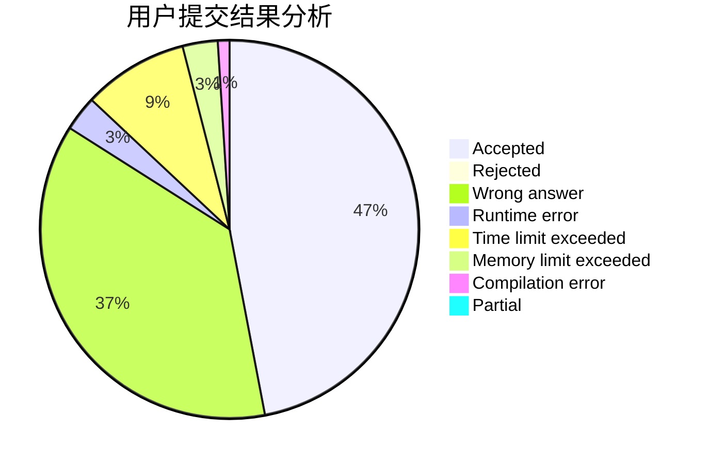
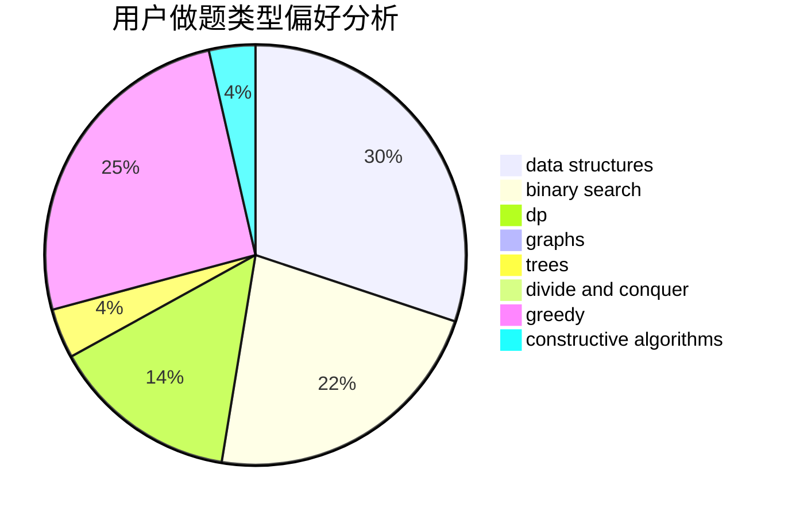
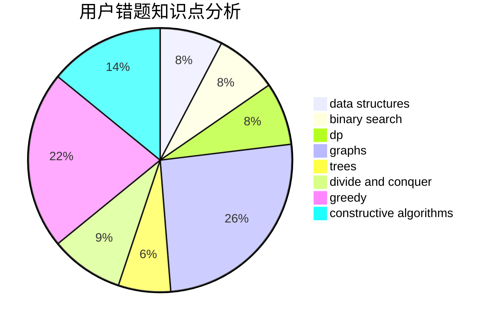

# jinhb5518

<!-- tabs:start -->

#### **用户提交结果分析**

#### **用户做题类型偏好分析**

#### **用户错题知识点分析**

<!-- tabs:end -->
# 推荐题目
[3162](https://codeforces.com/contest/316/problem/2)		dsu,graphs,sortings,trees		  
[1086C](https://codeforces.com/contest/1086/problem/C)		dsu,graphs,sortings,trees		  
[1373A](https://codeforces.com/contest/1373/problem/A)		greedy,
                        implementation,
                        math		  
[788B](https://codeforces.com/contest/788/problem/B)		combinatorics,
                        constructive algorithms,
                        dfs and similar,
                        dsu,
                        graphs		  
[24E](https://codeforces.com/contest/24/problem/E)		binary search		  
[221B](https://codeforces.com/contest/221/problem/B)		implementation		  
[313E](https://codeforces.com/contest/313/problem/E)		constructive algorithms,
                        data structures,
                        dsu,
                        greedy		  
[1361C](https://codeforces.com/contest/1361/problem/C)		binary search,
                        bitmasks,
                        constructive algorithms,
                        dfs and similar,
                        dsu,
                        graphs		  
[12131](https://codeforces.com/contest/1213/problem/1)		dsu,graphs,sortings,trees		  
[477D](https://codeforces.com/contest/477/problem/D)		dp,
                        strings		  
