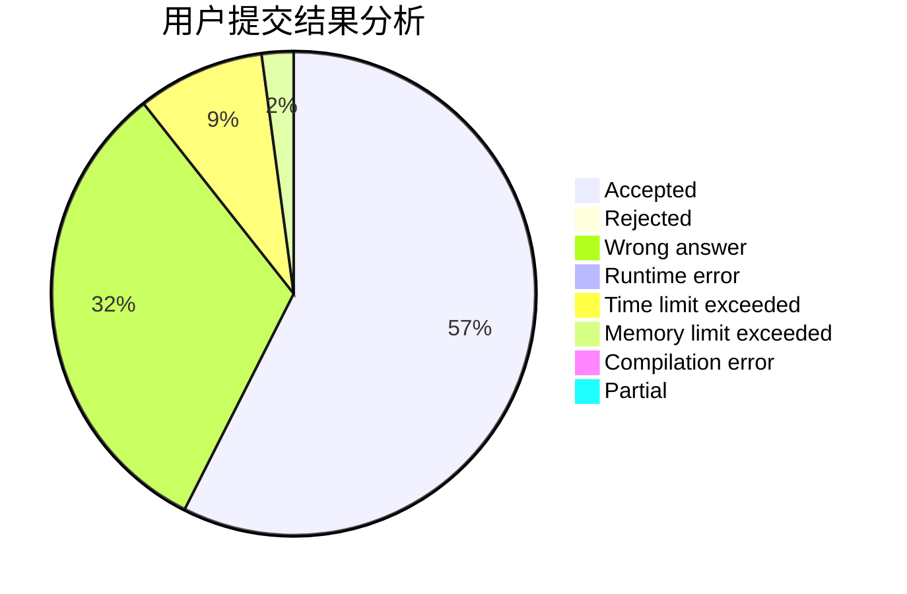
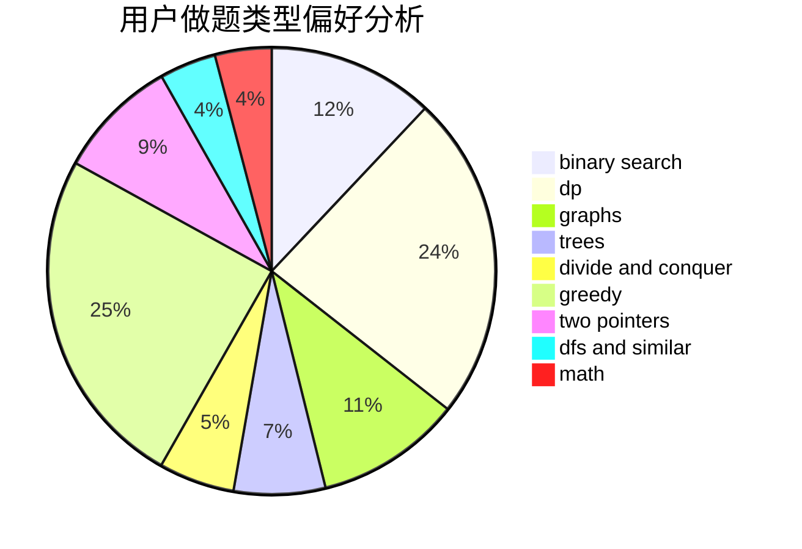

# BegoniaClub

<!-- tabs:start -->

#### **用户提交结果分析**

#### **用户做题类型偏好分析**

<!-- tabs:end -->
# 推荐题目
[1384A](https://codeforces.com/contest/1384/problem/A)
[1372B](https://codeforces.com/contest/1372/problem/B)
[1446E](https://codeforces.com/contest/1446/problem/E)
[312A](https://codeforces.com/contest/312/problem/A)
[1346A](https://codeforces.com/contest/1346/problem/A)
[540B](https://codeforces.com/contest/540/problem/B)
[540C](https://codeforces.com/contest/540/problem/C)
[190E](https://codeforces.com/contest/190/problem/E)
[431E](https://codeforces.com/contest/431/problem/E)
[35C](https://codeforces.com/contest/35/problem/C)
