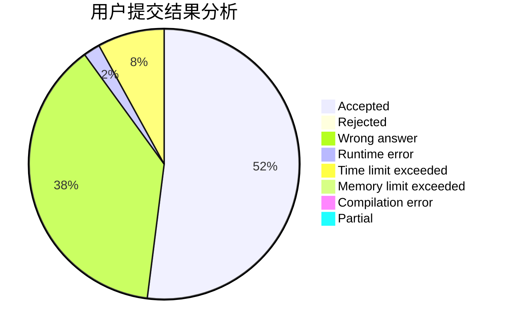
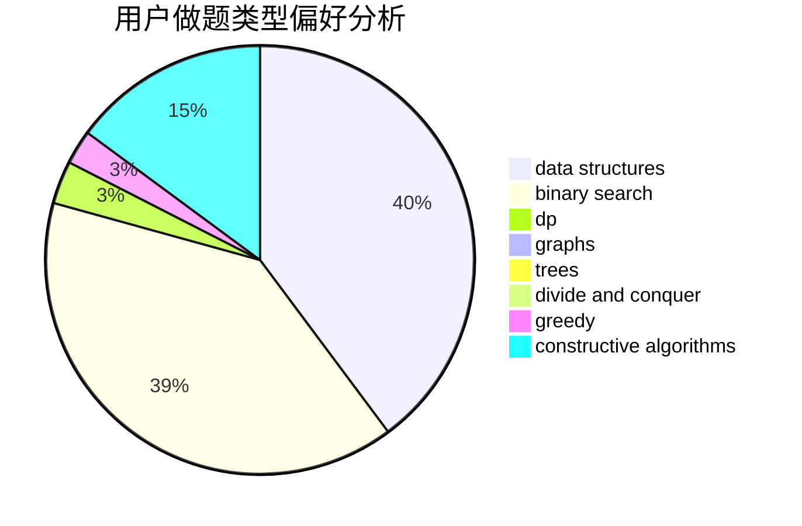
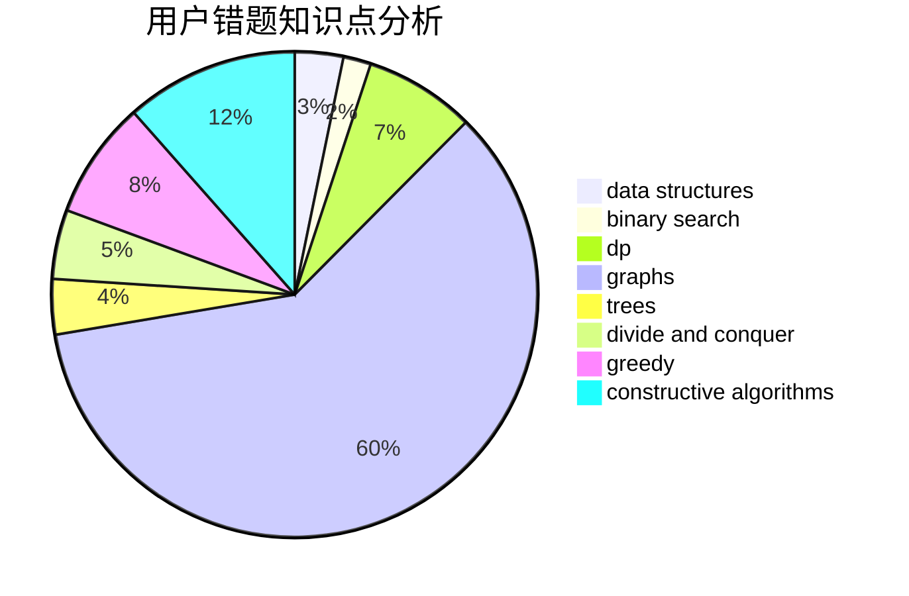

# jiubei

<!-- tabs:start -->

#### **用户提交结果分析**

#### **用户做题类型偏好分析**

#### **用户错题知识点分析**

<!-- tabs:end -->
# 推荐题目
[581A](https://codeforces.com/contest/581/problem/A)		implementation,
                        math		  
[1161A](https://codeforces.com/contest/1161/problem/A)		dsu,graphs,sortings,trees		  
[1030G](https://codeforces.com/contest/1030/problem/G)		number theory		  
[27A](https://codeforces.com/contest/27/problem/A)		implementation,
                        sortings		  
[513G1](https://codeforces.com/contest/513G/problem/1)		brute force,
                        dfs and similar,
                        dp,
                        meet-in-the-middle		  
[506E](https://codeforces.com/contest/506/problem/E)		combinatorics,
                        dp,
                        matrices,
                        strings		  
[356E](https://codeforces.com/contest/356/problem/E)		dp,
                        hashing,
                        implementation,
                        string suffix structures,
                        strings		  
[178F3](https://codeforces.com/contest/178F/problem/3)		nan		  
[19A](https://codeforces.com/contest/19/problem/A)		implementation		  
[1240C](https://codeforces.com/contest/1240/problem/C)		dsu,graphs,sortings,trees		  
