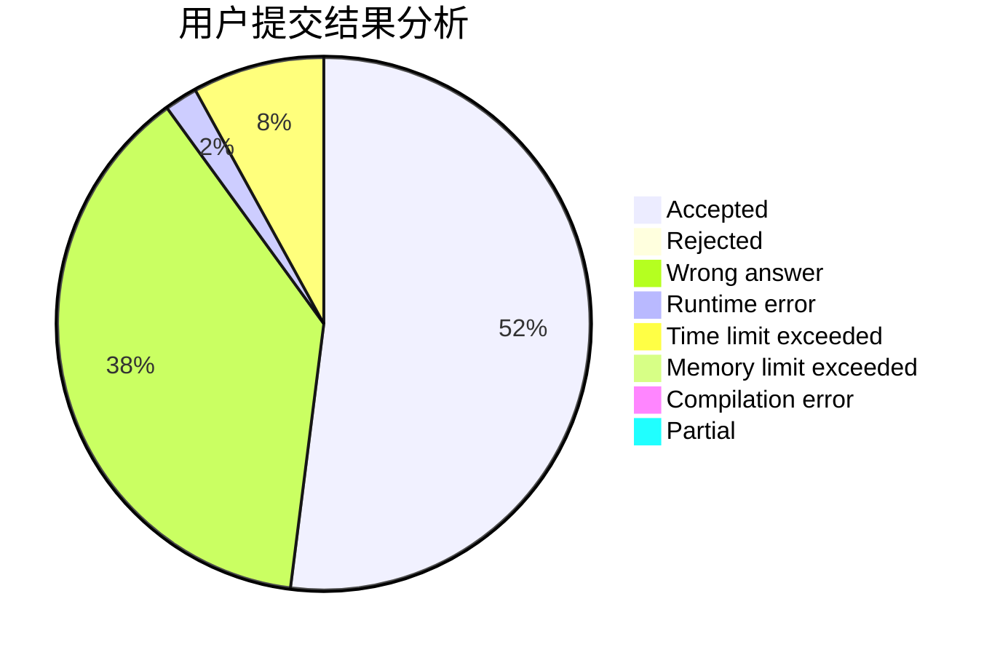
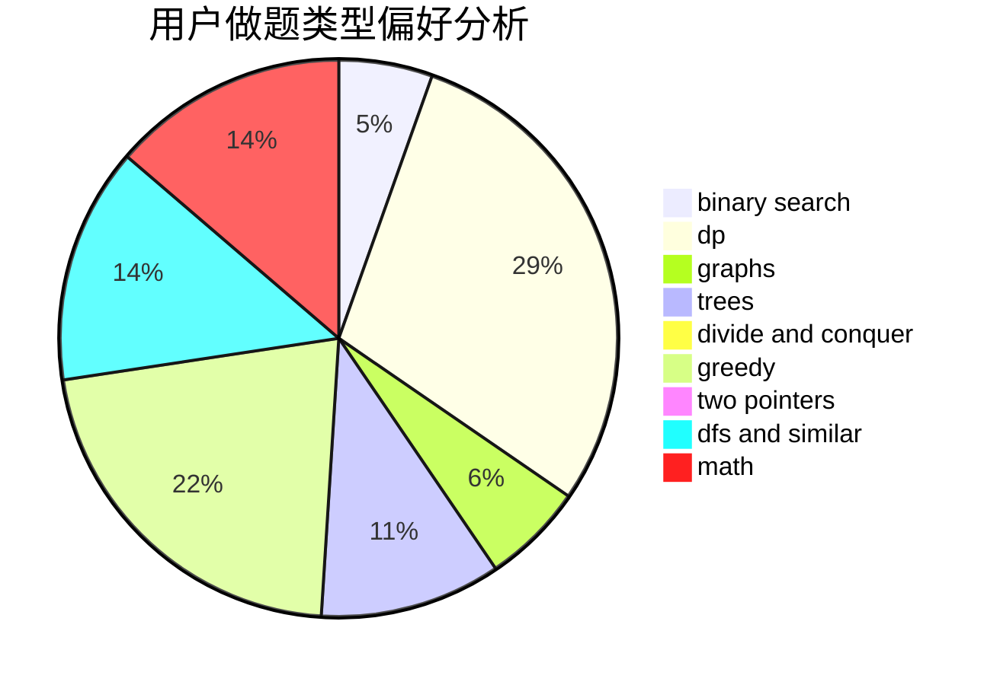

# jiubei

<!-- tabs:start -->

#### **用户提交结果分析**

#### **用户做题类型偏好分析**

<!-- tabs:end -->
# 推荐题目
[601B](https://codeforces.com/contest/601/problem/B)
[1163D](https://codeforces.com/contest/1163/problem/D)
[1031C](https://codeforces.com/contest/1031/problem/C)
[294E](https://codeforces.com/contest/294/problem/E)
[53D](https://codeforces.com/contest/53/problem/D)
[527B](https://codeforces.com/contest/527/problem/B)
[383A](https://codeforces.com/contest/383/problem/A)
[205A](https://codeforces.com/contest/205/problem/A)
[221B](https://codeforces.com/contest/221/problem/B)
[1245F](https://codeforces.com/contest/1245/problem/F)
