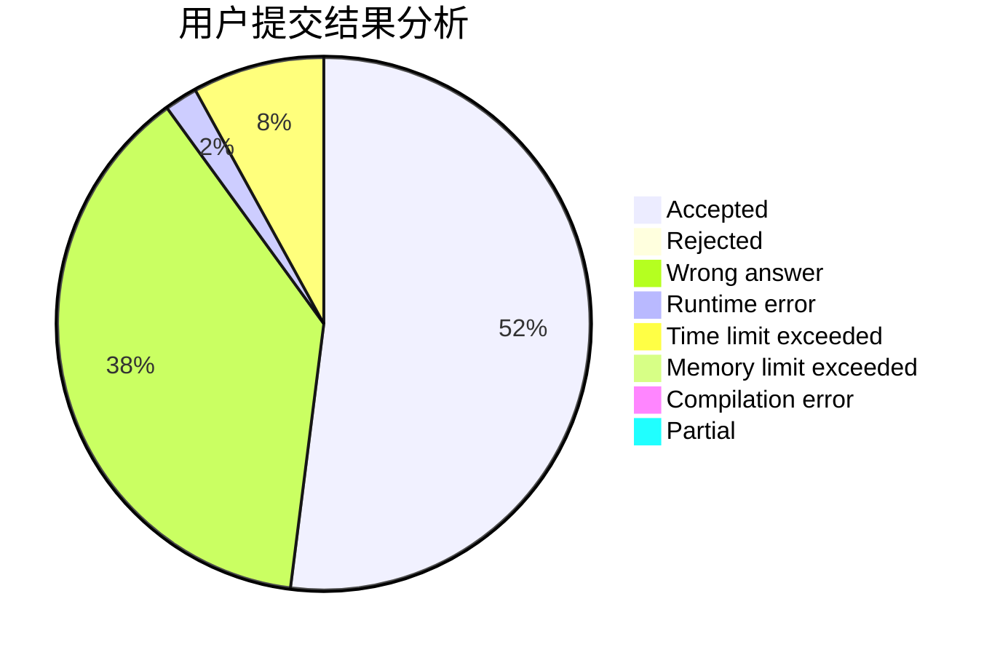
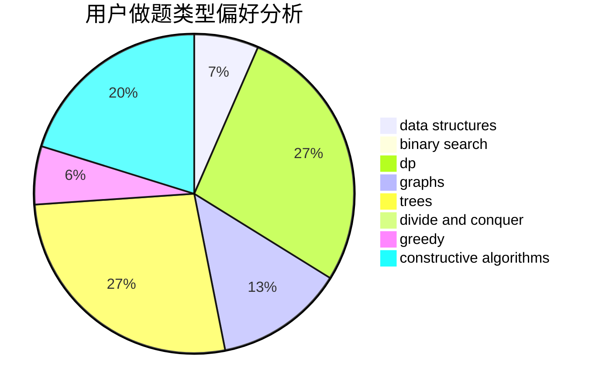
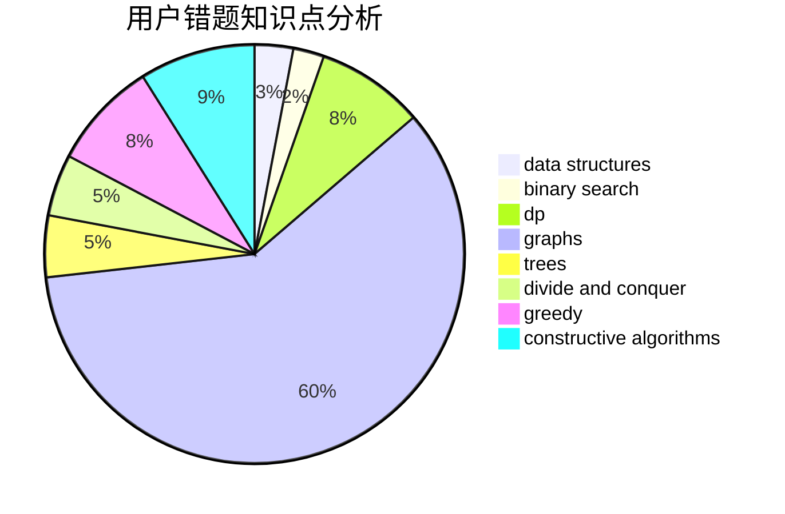

# jiubei

<!-- tabs:start -->

#### **用户提交结果分析**

#### **用户做题类型偏好分析**

#### **用户错题知识点分析**

<!-- tabs:end -->
# 推荐题目
[601B](https://codeforces.com/contest/601/problem/B)		data structures,
                        math		  
[1163D](https://codeforces.com/contest/1163/problem/D)		dp,
                        strings		  
[1031C](https://codeforces.com/contest/1031/problem/C)		greedy		  
[294E](https://codeforces.com/contest/294/problem/E)		dp,
                        trees		  
[53D](https://codeforces.com/contest/53/problem/D)		sortings		  
[527B](https://codeforces.com/contest/527/problem/B)		greedy		  
[383A](https://codeforces.com/contest/383/problem/A)		data structures,
                        greedy		  
[205A](https://codeforces.com/contest/205/problem/A)		brute force,
                        implementation		  
[221B](https://codeforces.com/contest/221/problem/B)		implementation		  
[1245F](https://codeforces.com/contest/1245/problem/F)		bitmasks,
                        brute force,
                        combinatorics,
                        dp		  
