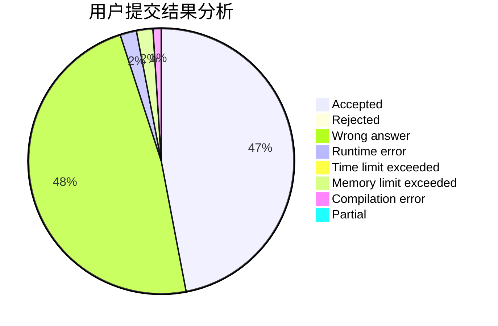
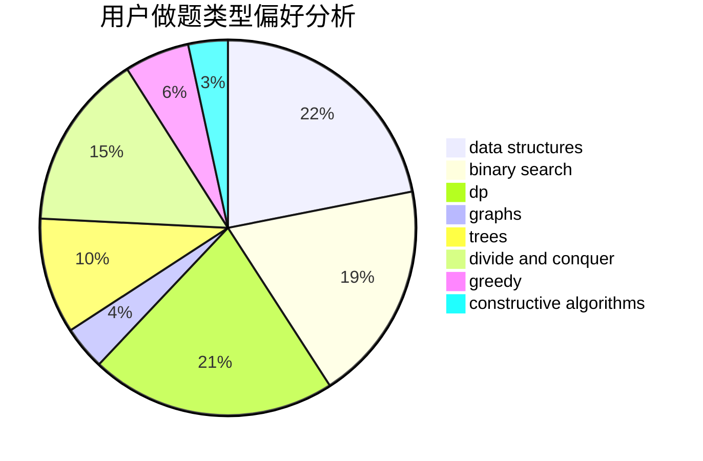
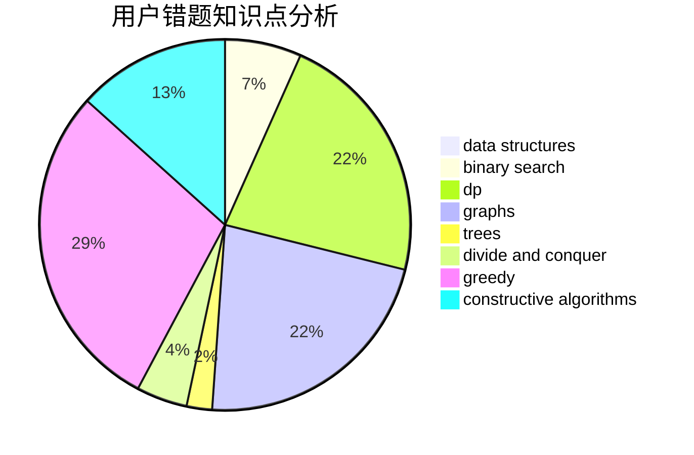

# jiufeng

<!-- tabs:start -->

#### **用户提交结果分析**

#### **用户做题类型偏好分析**

#### **用户错题知识点分析**

<!-- tabs:end -->
# 推荐题目
[579A](https://codeforces.com/contest/579/problem/A)		bitmasks		  
[293A](https://codeforces.com/contest/293/problem/A)		games,
                        greedy		  
[1166F](https://codeforces.com/contest/1166/problem/F)		data structures,
                        dsu,
                        graphs,
                        hashing		  
[1384E](https://codeforces.com/contest/1384/problem/E)		dsu,graphs,sortings,trees		  
[581A](https://codeforces.com/contest/581/problem/A)		implementation,
                        math		  
[462A](https://codeforces.com/contest/462/problem/A)		brute force,
                        implementation		  
[1009E](https://codeforces.com/contest/1009/problem/E)		combinatorics,
                        math,
                        probabilities		  
[1411A](https://codeforces.com/contest/1411/problem/A)		implementation		  
[487B](https://codeforces.com/contest/487/problem/B)		binary search,
                        data structures,
                        dp,
                        two pointers		  
[545E](https://codeforces.com/contest/545/problem/E)		graphs,
                        greedy,
                        shortest paths		  
