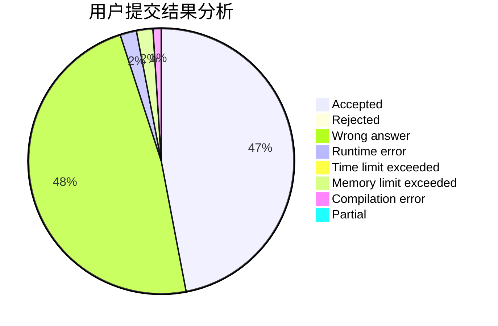
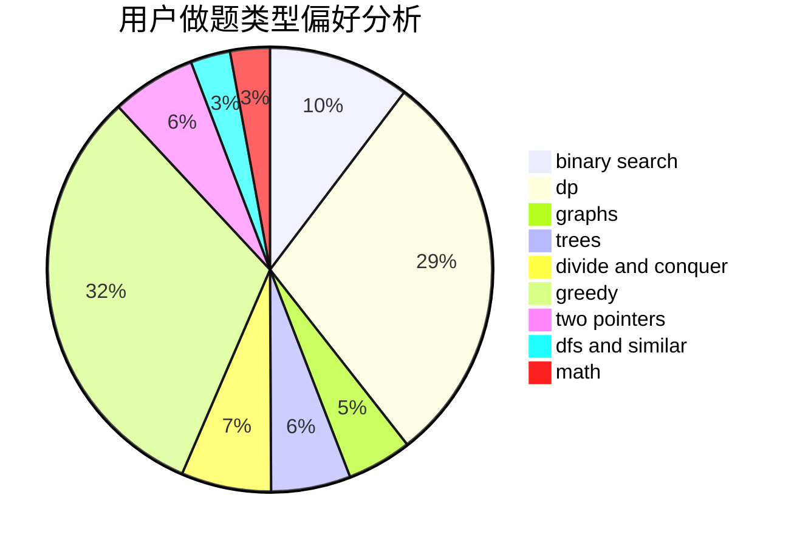

# jiufeng

<!-- tabs:start -->

#### **用户提交结果分析**

#### **用户做题类型偏好分析**

<!-- tabs:end -->
# 推荐题目
[579A](https://codeforces.com/contest/579/problem/A)
[293A](https://codeforces.com/contest/293/problem/A)
[1166F](https://codeforces.com/contest/1166/problem/F)
[1384E](https://codeforces.com/contest/1384/problem/E)
[581A](https://codeforces.com/contest/581/problem/A)
[462A](https://codeforces.com/contest/462/problem/A)
[1009E](https://codeforces.com/contest/1009/problem/E)
[1411A](https://codeforces.com/contest/1411/problem/A)
[487B](https://codeforces.com/contest/487/problem/B)
[545E](https://codeforces.com/contest/545/problem/E)
