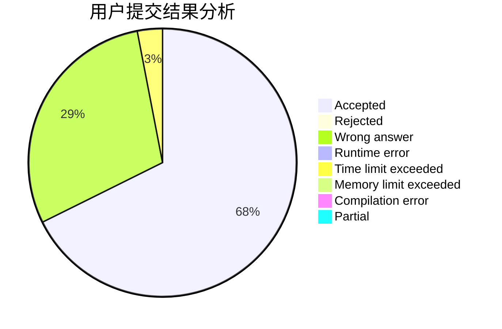
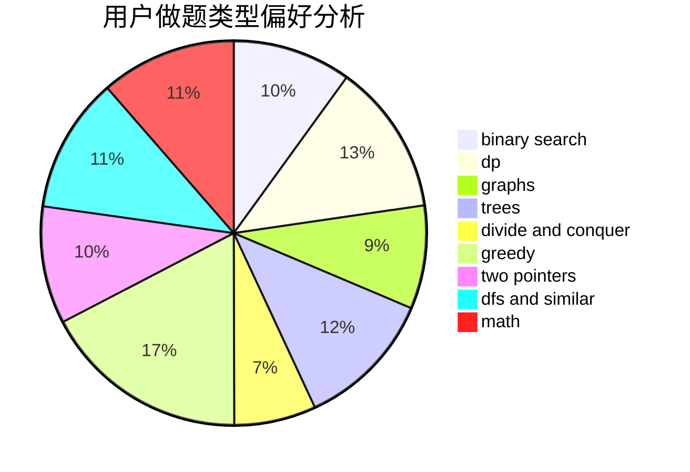

# jiuruifu

<!-- tabs:start -->

#### **用户提交结果分析**

#### **用户做题类型偏好分析**

<!-- tabs:end -->
# 推荐题目
[282A](https://codeforces.com/contest/282/problem/A)
[1325B](https://codeforces.com/contest/1325/problem/B)
[630J](https://codeforces.com/contest/630/problem/J)
[1290A](https://codeforces.com/contest/1290/problem/A)
[234A](https://codeforces.com/contest/234/problem/A)
[1131D](https://codeforces.com/contest/1131/problem/D)
[835C](https://codeforces.com/contest/835/problem/C)
[415A](https://codeforces.com/contest/415/problem/A)
[14C](https://codeforces.com/contest/14/problem/C)
[1016D](https://codeforces.com/contest/1016/problem/D)
