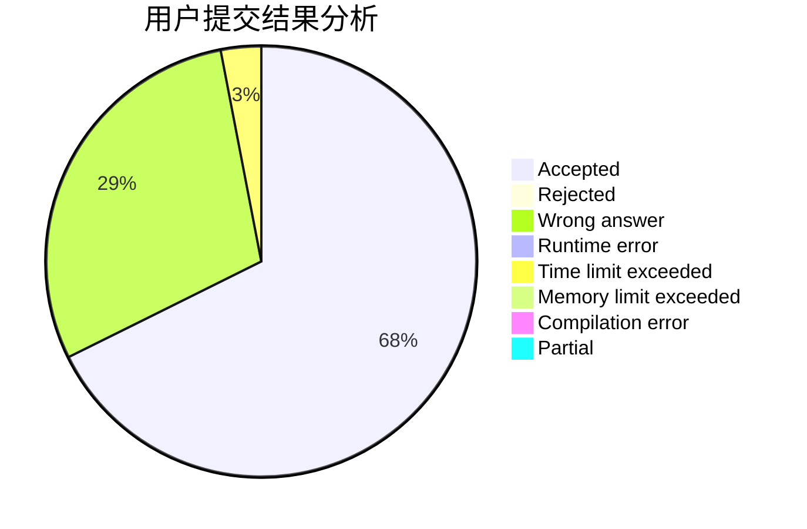
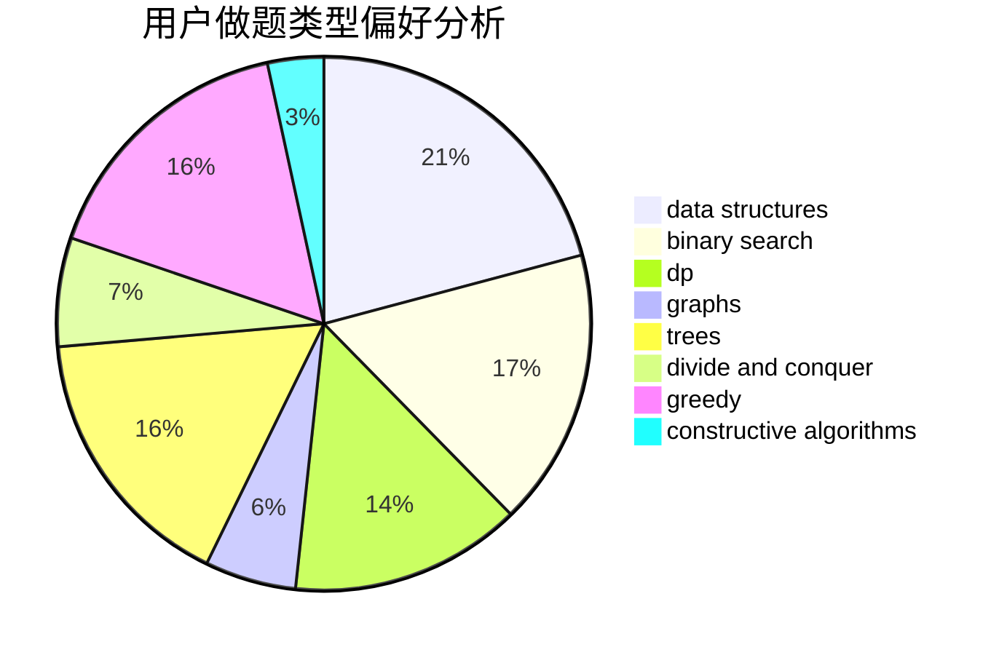
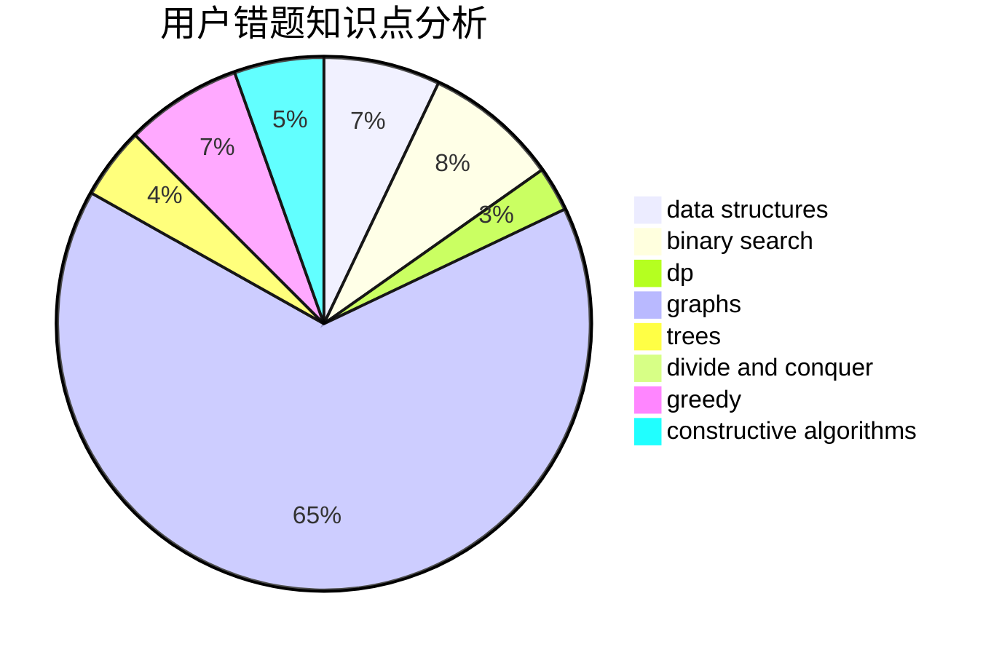

# jiuruifu

<!-- tabs:start -->

#### **用户提交结果分析**

#### **用户做题类型偏好分析**

#### **用户错题知识点分析**

<!-- tabs:end -->
# 推荐题目
[282A](https://codeforces.com/contest/282/problem/A)		implementation		  
[1325B](https://codeforces.com/contest/1325/problem/B)		greedy,
                        implementation		  
[630J](https://codeforces.com/contest/630/problem/J)		math,
                        number theory		  
[1290A](https://codeforces.com/contest/1290/problem/A)		brute force,
                        data structures,
                        implementation		  
[234A](https://codeforces.com/contest/234/problem/A)		implementation		  
[1131D](https://codeforces.com/contest/1131/problem/D)		dfs and similar,
                        dp,
                        dsu,
                        graphs,
                        greedy		  
[835C](https://codeforces.com/contest/835/problem/C)		dp,
                        implementation		  
[415A](https://codeforces.com/contest/415/problem/A)		implementation		  
[14C](https://codeforces.com/contest/14/problem/C)		brute force,
                        constructive algorithms,
                        geometry,
                        implementation,
                        math		  
[1016D](https://codeforces.com/contest/1016/problem/D)		constructive algorithms,
                        flows,
                        math		  
